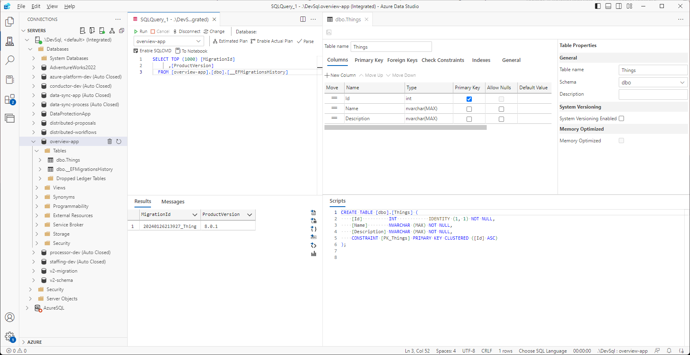
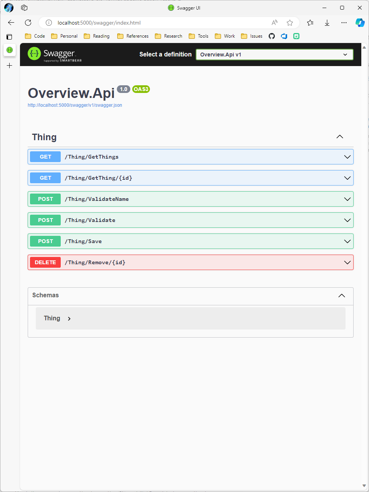
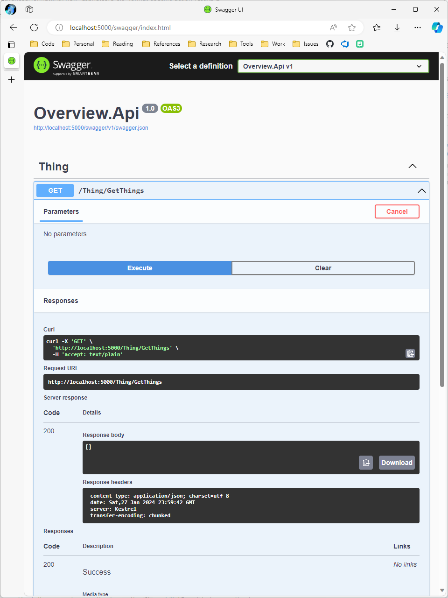
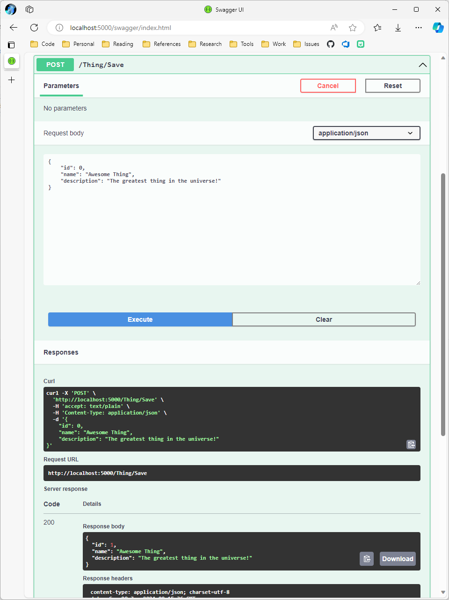
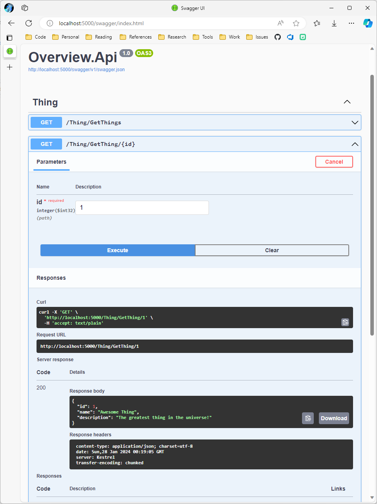
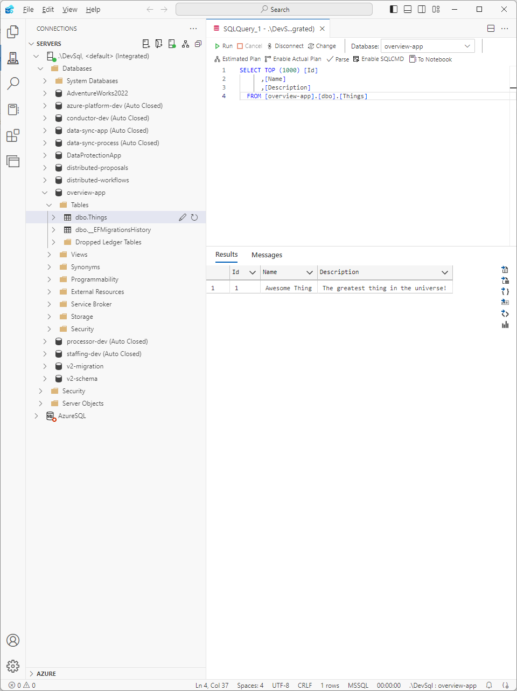

# Node Development

The following sections will provide a very simplified, high-level walkthrough of building each component of a SQL-backed REST API.

## Models

The foundation of any capability is its data. You cannot effectively build an application without having a firm grasp on the information you want to store, how that information should be structured, and how the information should be allowed to interact with other information. The `Models` project is all about defining data models.

In the [`Overview.Models`](./overview/node/Overview.Models/) directory, rename `Class1.cs` to `Thing.cs`.

We are going to create a very simple .NET class named `Thing`. As with all things, it should have a `Name`. It should also have an identifier, `Id`, as well as a way to convey a deeper understanding of the object, a `Description`. With this in mind, `Thing` should look as follows:

```cs
namespace Overview.Models;

public class Thing
{
    public int Id { get; set; }
    public string Name { get; set; } = string.Empty;
    public string Description { get; set; } = string.Empty;
}
```

This class definition essentially specifies that an [object of type](https://learn.microsoft.com/en-us/dotnet/csharp/fundamentals/types/classes) `Thing` has three [properties](https://learn.microsoft.com/en-us/dotnet/csharp/properties). This basic setup allows us to define data models and the kinds of information they can contain. In this case, a numerical, whole number identifier (an [`integer`](https://learn.microsoft.com/en-us/dotnet/csharp/language-reference/builtin-types/integral-numeric-types) named `Id`) and two [string](https://learn.microsoft.com/en-us/dotnet/csharp/language-reference/builtin-types/reference-types#the-string-type) properties.

## Data

Now that we have a model, we need a way of storing data associated with that model. This process can be drastically simplified by relying on an [Object Relational Mapper (ORM)](https://en.wikipedia.org/wiki/Object%E2%80%93relational_mapping). .NET provides an official ORM called [Entity Framework Core](https://learn.microsoft.com/en-us/ef/core/).

### EF CLI

To start, ensure that the [`dotnet-ef`](https://learn.microsoft.com/en-us/ef/core/cli/dotnet) CLI tool has been installed:

```pwsh
# check installation
dotnet ef

# install if not present
dotnet tool install --global dotnet-ef
```

You should see the following output:

```
                     _/\__       
               ---==/    \\      
         ___  ___   |.    \|\    
        | __|| __|  |  )   \\\   
        | _| | _|   \_/ |  //|\\ 
        |___||_|       /   \\\/\\

Entity Framework Core .NET Command-line Tools 8.0.0

Usage: dotnet ef [options] [command]

Options:
  --version        Show version information
  -h|--help        Show help information
  -v|--verbose     Show verbose output.
  --no-color       Don't colorize output.
  --prefix-output  Prefix output with level.

Commands:
  database    Commands to manage the database.
  dbcontext   Commands to manage DbContext types.
  migrations  Commands to manage migrations.

Use "dotnet ef [command] --help" for more information about a command.
```

### DbContext

Next, we need to define a [`DbContext`](https://learn.microsoft.com/en-us/ef/core/dbcontext-configuration/#the-dbcontext-lifetime) class. This class is responsible for interfacing with the underlying SQL Server database. It translates all of our requests to retrieve or mutate data into T-SQL commands.

At the root of the [`Overview.Data`](./overview/node/Overview.Data/) project, create a new file named `AppDbContext.cs` with the following structure:

```cs
using Microsoft.EntityFrameworkCore;

namespace Overview.Data;
public class AppDbContext : DbContext
{
    public AppDbContext(DbContextOptions<AppDbContext> options) : base(options)
    { }
}
```

The [`using`](https://learn.microsoft.com/en-us/dotnet/csharp/language-reference/statements/using) statement at the top indicates that we want to bring all of the code infrastructure defined by the `Microsoft.EntityFrameworkCore` library into our file. This means that these code artifacts are defined in a [`namespace`](https://learn.microsoft.com/en-us/dotnet/csharp/language-reference/keywords/namespace) of `Microsoft.EntityFrameworkCore`. It is declared in the same way as our classes using the `namespace` keyword (in this case, `Overview.Data`).

The statement `AppDbContext : DbContext` means that `AppDbContext` [inherits](https://learn.microsoft.com/en-us/dotnet/csharp/fundamentals/object-oriented/inheritance) from the [DbContext](https://learn.microsoft.com/en-us/dotnet/api/microsoft.entityframeworkcore.dbcontext?view=efcore-8.0) class defined by `Microsoft.EntityFrameworkCore`.

The statement that starts with `public AppDbContext` inside of the class is the [constructor](https://learn.microsoft.com/en-us/dotnet/csharp/programming-guide/classes-and-structs/constructors). This specifies how an object can be created. Our data model `Thing` does not have a constructor, so an instance of it can be created without any arguments as follows:

```cs
Thing thing = new Thing();

# simplified - the compiler can infer the type
Thing thing = new();
```

In `AppDbContext`, it expects to receive an object of type `DbContextOptions<AppDbContext>`. Classes that specify another class type within angle brackets, `<T>`, are called [generic classes](https://learn.microsoft.com/en-us/dotnet/csharp/fundamentals/types/generics). This means that they're underlying functionality can flexibly work with different types of data.

If the base class, or the class that is being inherited, specifies a constructor with parameters, those values can be passed to the base constructor the `base` keyword as demonstrated in the constructor above: `: base(options)`.

Classes can have zero or more constructors as long as the signatures of the constructors do not match. If a class only has one constructor, it can leverage a new C# feature called [primary constructors]() to simplify the class definition. Our `AppDbContext` class can be simplified as follows:

```cs
using Microsoft.EntityFrameworkCore;

namespace Overview.Data;
public class AppDbContext(DbContextOptions<AppDbContext> options) : DbContext(options)
{ }
```

The only thing left to do with `AppDbContext` is specify the `Thing` table interface. This is done by defining a [`DbSet<T>`](https://learn.microsoft.com/en-us/ef/core/modeling/entity-types?tabs=data-annotations#including-types-in-the-model):

```cs
using Microsoft.EntityFrameworkCore;
using Overview.Models;

namespace Overview.Data;
public class AppDbContext(DbContextOptions<AppDbContext> options) : DbContext(options)
{
    public DbSet<Thing> Things => Set<Thing>();
}
```

Notice that to use the `Thing` class, the `Overview.Models` namespace had to be brought into scope with the `using` keyword at the top of the file. This is possible because we defined a reference to `Overview.Models` inside of `Overview.Data` in the [Create project references](#create-project-references) section above.

### Configure SQL Project Connection

Before we can connect the project to SQL server, we need to incorporate some changes that make the project self-sufficient. This is why it was initialized with `dotnet new console` instead of just `dotnet new classlib`. We can leverage the [.NET Generic Host](https://learn.microsoft.com/en-us/dotnet/core/extensions/generic-host?tabs=appbuilder) to manage initialization and lifetime of `AppDbContext`.

First, we need to add a framework reference to `Microsoft.AspNetCore.App` in the [`Overview.Data.csproj`](./overview/node/Overview.Data/Overview.Data.csproj) file. Unfortunately, the dotnet cli does not have a way of specifying this from the command line, so it has to be added manually. Your full `.csproj` file should look like this:

```xml
<Project Sdk="Microsoft.NET.Sdk">

  <ItemGroup>
    <FrameworkReference Include="Microsoft.AspNetCore.App" />
  </ItemGroup>

  <ItemGroup>
    <ProjectReference Include="..\Overview.Models\Overview.Models.csproj" />
  </ItemGroup>

  <ItemGroup>
    <PackageReference Include="Microsoft.EntityFrameworkCore.SqlServer" Version="8.0.1" />
    <PackageReference Include="Microsoft.EntityFrameworkCore.Tools" Version="8.0.1">
      <IncludeAssets>runtime; build; native; contentfiles; analyzers; buildtransitive</IncludeAssets>
      <PrivateAssets>all</PrivateAssets>
    </PackageReference>
  </ItemGroup>

  <PropertyGroup>
    <OutputType>Exe</OutputType>
    <TargetFramework>net8.0</TargetFramework>
    <ImplicitUsings>enable</ImplicitUsings>
    <Nullable>enable</Nullable>
  </PropertyGroup>

</Project>
```

Next, we need to create appsettings files that contain our environment-specific [configuration](https://learn.microsoft.com/en-us/aspnet/core/fundamentals/configuration/?view=aspnetcore-8.0).

At the root of `Overview.Data`, create a file named `appsettings.json` with the following values:

```json
{
    "Logging": {
        "LogLevel": {
            "Default": "Information",
            "Microsoft.AspNetCore": "Warning"
        }
    },
    "AllowedHosts": "*"
}
```

This specifies default configuration settings that any environment-specific configurations inherit. Note that if an environment-specific setting specifies the same value, it overrides the value inherited from the root configuration.

To specify our development configuration, create a file named `appsettings.Development.json` with the following values:

```json
{
    "ConnectionStrings": {
        "App": "Server=.\\DevSql;Trusted_Connection=True;TrustServerCertificate=True;Database=overview-app"
    }
}
```

This defines a connection string named `App` pointed to a database named `overview-app` in our local `DevSql` server.

All that's left to do before we connect to SQL is define the app runtime in [`Program.cs`](./overview/node/Overview.Data/Program.cs):

```cs
using Microsoft.EntityFrameworkCore;
using Microsoft.Extensions.Configuration;
using Microsoft.Extensions.DependencyInjection;
using Microsoft.Extensions.Hosting;
using Overview.Data;

HostApplicationBuilder builder = Host.CreateApplicationBuilder(args);
builder.Configuration.AddCommandLine(args);

builder
    .Services
    .AddDbContext<AppDbContext>(options =>
    {
        options.UseQueryTrackingBehavior(QueryTrackingBehavior.NoTracking);
        options.UseSqlServer(builder.Configuration.GetConnectionString("App"));
    });

using IHost host = builder.Build();
await host.RunAsync();
```

The primary thing to notice here is the registration of `AppDbContext` with the `Services` container in the app builder. This is an example using native .NET [Dependency Injection](https://learn.microsoft.com/en-us/aspnet/core/fundamentals/dependency-injection?view=aspnetcore-8.0) to register a service.

The registration is conducted using the [`AddDbContext`](https://learn.microsoft.com/en-us/ef/core/dbcontext-configuration/#dbcontext-in-dependency-injection-for-aspnet-core) method (the .NET term for a function is a method), which is also responsible for configuring the options associated with the service. This is done using a delegate function to define design-time configuration:

```cs
.AddDbContext<AppDbContext>(options =>
{
    // configure options
});
```

The argument type for `.AddDbContext` is `Action<DbContextOptionsBuilder>`. [`Action<T>`](https://learn.microsoft.com/en-us/dotnet/api/system.action-1?view=net-8.0) is a [delegate function](https://learn.microsoft.com/en-US/dotnet/csharp/programming-guide/delegates/) that provides an argument of type `T` to the function and does not have a return value. The options specified in this configuration are what is used to compose the `DbContextOptions` passed into the constructor of `AppDbContext`.

> Delegate functions and generics are advanced .NET concepts. They are introduced in this section because you will work with them a lot and need to start building a conceptual idea of what they are. Luckily, they are pretty easy and powerful to work with, but learning how to craft your own use cases comes with a lot of time and experience.

### Generating the Database

In order to generate a database, there are two things you need to do:

1. Create a [database migration](https://learn.microsoft.com/en-us/ef/core/managing-schemas/migrations/?tabs=dotnet-core-cli), which takes the state of the data models registered with `AppDbContext` and generates instructions for how to transition your database to the current state. It also includes instructions for how to roll your database back to its previous state in the event the migration does not work out. As your data models and configurations evolve over time, you can create new migrations to evolve the underlying database.

2. Initiate an [update](https://learn.microsoft.com/en-us/ef/core/managing-schemas/migrations/?tabs=dotnet-core-cli#create-your-database-and-schema) to the underlying database. If the database does not exist, it will create it and apply all generated migrations in sequence they were created. If a database does exist, it will apply every migration that has not been applied in sequence.

From the root of the `Overview.Data` project, execute the following command:

```pwsh
dotnet ef migrations add "Thing"
```

You should see the following output:

```
Build started...
Build succeeded.
```

This command generates a [Migrations](./overview/node/Overview.Data/Migrations) directory that keeps track of each migration as well as the current model snapshot.

To create the database and schema, execute the following command:

```pwsh
dotnet ef database update
```

You should see the following output:

```
Build started...
Build succeeded.
info: Microsoft.EntityFrameworkCore.Database.Command[20101]
      Executed DbCommand (185ms) [Parameters=[], CommandType='Text', CommandTimeout='60']
      CREATE DATABASE [overview-app];
info: Microsoft.EntityFrameworkCore.Database.Command[20101]
      Executed DbCommand (64ms) [Parameters=[], CommandType='Text', CommandTimeout='60']
      IF SERVERPROPERTY('EngineEdition') <> 5
      BEGIN
          ALTER DATABASE [overview-app] SET READ_COMMITTED_SNAPSHOT ON;
      END;
info: Microsoft.EntityFrameworkCore.Database.Command[20101]
      Executed DbCommand (5ms) [Parameters=[], CommandType='Text', CommandTimeout='30']
      SELECT 1
info: Microsoft.EntityFrameworkCore.Database.Command[20101]
      Executed DbCommand (9ms) [Parameters=[], CommandType='Text', CommandTimeout='30']
      CREATE TABLE [__EFMigrationsHistory] (
          [MigrationId] nvarchar(150) NOT NULL,
          [ProductVersion] nvarchar(32) NOT NULL,
          CONSTRAINT [PK___EFMigrationsHistory] PRIMARY KEY ([MigrationId])
      );
info: Microsoft.EntityFrameworkCore.Database.Command[20101]
      Executed DbCommand (0ms) [Parameters=[], CommandType='Text', CommandTimeout='30']
      SELECT 1
info: Microsoft.EntityFrameworkCore.Database.Command[20101]
      Executed DbCommand (9ms) [Parameters=[], CommandType='Text', CommandTimeout='30']
      SELECT OBJECT_ID(N'[__EFMigrationsHistory]');
info: Microsoft.EntityFrameworkCore.Database.Command[20101]
      Executed DbCommand (11ms) [Parameters=[], CommandType='Text', CommandTimeout='30']
      SELECT [MigrationId], [ProductVersion]
      FROM [__EFMigrationsHistory]
      ORDER BY [MigrationId];
info: Microsoft.EntityFrameworkCore.Migrations[20402]
      Applying migration '20240126213927_Thing'.
Applying migration '20240126213927_Thing'.
info: Microsoft.EntityFrameworkCore.Database.Command[20101]
      Executed DbCommand (2ms) [Parameters=[], CommandType='Text', CommandTimeout='30']
      CREATE TABLE [Things] (
          [Id] int NOT NULL IDENTITY,
          [Name] nvarchar(max) NOT NULL,
          [Description] nvarchar(max) NOT NULL,
          CONSTRAINT [PK_Things] PRIMARY KEY ([Id])
      );
info: Microsoft.EntityFrameworkCore.Database.Command[20101]
      Executed DbCommand (6ms) [Parameters=[], CommandType='Text', CommandTimeout='30']
      INSERT INTO [__EFMigrationsHistory] ([MigrationId], [ProductVersion])
      VALUES (N'20240126213927_Thing', N'8.0.1');
Done.
```

You can verify that the database has been created by connecting to `DevSql` in Azure Data Studio:



Here, you can see the `overview-app` contains a `Things` table as well as an `__EFMigrationsHistory` table. The `__EFMigrationsHistory` table is used to keep track of the migrations that have been applied to the database so you can keep your data models in sync with your project.

## Services

Services can be used to provide a host of functionality to your API. They don't need to purely focus on defining SQL-backed data model logic, but this is an excellent use case for demonstrating how to define and register services.

A service is nothing more than a class that defines functionality associated with a specific data model or capability. It could be anything from executing a PowerShell script to generate a GIF to leveraging the [OpenXML SDK](https://github.com/dotnet/Open-XML-SDK) to generate an Excel spreadsheet.

In our current case, we want to define a service that can:

* Get all Things
* Get a Thing by Id
* Validate that `Thing.Name` is unique
* Validate the overall state of a `Thing` so that `Thing.Name` always has a value and it is distinct from all other `Thing` records.
* Save a `Thing`
* Remove a `Thing`

To get started, rename `Class1.cs` to `ThingService.cs`. Now, because `AppDbContext` will be registered with dependency injection, we can inject an instance into `ThingService`. The first thing we will do is define `ThingService` with a primary constructor that injects `AppDbContext`:

```cs
using Overview.Data;

namespace Overview.Services;

public class ThingService(AppDbContext db)
{
    readonly AppDbContext db = db;
}
```

Next, we need to define the methods that enable our desired functionality. To start, we need to be able to get all `Thing` records:

```cs
public async Task<List<Thing>> GetThings() =>
    await db.Things.ToListAsync();
```

The `Microsoft.EntityFrameworkCore` library defines an [extension method](https://learn.microsoft.com/en-us/dotnet/csharp/programming-guide/classes-and-structs/extension-methods) for `DbSet<T>` called `ToListAsync()` that allows us to [asynchronously](https://learn.microsoft.com/en-us/dotnet/csharp/asynchronous-programming/) retrieve the data from the data set.

> Before I had a solid understanding of how to leverage inheritance to simplify my code structure, I used to define my services purely as static classes full of extension methods. It was incredibly unwieldy and inflexible. You should only ever write extension methods as utilities for classes that you don't own. And even then, this should be done very sparingly.

The next method is to retrieve a single `Thing` by its unique `Id`:

```cs
public async Task<Thing?> GetThing(int id) =>
    await db.Things.FindAsync(id);
```

Notice that the return type for `GetThing` is `Task<Thing?>`. The `?` indicates that the return value could be `null`, meaning it has no value. If you think about it, this certainly makes sense. Imagine the `Thing` table only has 10 records with IDs of 1 - 10 and someone calls `GetThing(30)`. There is no record that exists with an ID of 30, but we do not want that to throw an unnecessary exception. Instead, it should just return `null` and allow the caller to handle that value appropriately (for instance, returning a `404 Not Found` response from an HTTP call).

Again, `FindAsync()` is a method defined by `Microsoft.EntityFrameworkCore`.

> For a comprehensive understanding of querying data with Entity Framework Core, see [Querying Data](https://learn.microsoft.com/en-us/ef/core/querying/).

Now that you have a base understanding of how this works, the full service class is as follows:

```cs
using Microsoft.EntityFrameworkCore;
using Overview.Data;
using Overview.Models;

namespace Overview.Services;

public class ThingService(AppDbContext db)
{
    readonly AppDbContext db = db;

    public async Task<List<Thing>> GetThings() =>
        await db.Things.ToListAsync();

    public async Task<Thing?> GetThing(int id) =>
        await db.Things.FindAsync(id);

    public async Task<bool> ValidateName(Thing thing) =>
        !await db.Things.AnyAsync(x =>
            x.Id != thing.Id
            && x.Name.ToLower() == thing.Name.ToLower()
        );

    public async Task<bool> Validate(Thing thing)
    {
        bool valid = true;

        if (string.IsNullOrWhiteSpace(thing.Name))
            valid = false;

        if (!await ValidateName(thing))
            valid = false;

        return valid;
    }

    public async Task<Thing?> Save(Thing thing)
    {
        if (await Validate(thing))
        {
            int result = thing.Id > 0
                ? await Update(thing)
                : await Add(thing);

            return result > 0
                ? thing
                : null;
        }
        else
            throw new Exception($"Save: Thing {thing.Id} - {thing.Name} is invalid");
    }

    public async Task<int> Remove(int id)
    {
        Thing? thing = await GetThing(id);

        if (thing is null)
            return 0;

        db.Things.Remove(thing);
        return await db.SaveChangesAsync();
    }

    async Task<int> Add(Thing thing)
    {
        await db.Things.AddAsync(thing);
        return await db.SaveChangesAsync();
    }

    async Task<int> Update(Thing thing)
    {
        db.Things.Update(thing);
        return await db.SaveChangesAsync();
    }
}
```

Some key points to note:

* Only the method marked with `public` can be called by a user of `ThingService`. The `Add` and `Update` functions are private and therefore internal to the class. This simplifies our API by allowing us to expose a single `Save` vs. having separate `Add` and `Update` methods.

    * See [Accessibility Levels](https://learn.microsoft.com/en-us/dotnet/csharp/language-reference/keywords/accessibility-levels).

* `ValidateName` makes use of the [boolean logical operators](https://learn.microsoft.com/en-us/dotnet/csharp/language-reference/operators/boolean-logical-operators) `!=` (does not equal) and `==` (is equal to) inside of Entity Frameworks `AnyAsync` function. Returns the inverse by applying the `!` boolean logical operator to the result of `AnyAsync`. If any values that match the filter are found, the name is invalid but the `AnyAsync` method will return `true`. We want `ValidateName` to return `false` if any values are found, and this can easily be done by prepending the operation with `!`.

* `Save` makes use of the [ternary conditional operator](https://learn.microsoft.com/en-us/dotnet/csharp/language-reference/operators/conditional-operator) `?:` to simplify calling `Add` or `Update` as well as the return value. This is a shorthand syntax that is equivalent to:

    ```cs
    // if-else
    if (condition)
    {
        // execute if true
    }
    else
    {
        // execute if false
    }
    ```
    and is evaluated as:
    
    ```cs
    return condition
        ? execute if true
        : execute if false;
    ```

* `Remove` uses the newer [is](https://learn.microsoft.com/en-US/dotnet/csharp/language-reference/operators/is) operator to check if `thing` is `null`: `if (thing is null)`. This is equivalent to `if (thing != null)`.

    * Be aware that you cannot use the `is` operator inside of Entity Framework expressions. For instance, the following is invalid:
    
        ```cs
        db.Things.AnyAsync(x => x.Description is not null);
        ```

        You will get a design-time error stating *"An expression tree may not contain an 'is' pattern matching operator"*.

## API

Web API projects provide an HTTP-based REST interface into your backend infrastructure. It allows any external resource to interact with your platform, e.g. - web, desktop, or CLI applications and even other APIs.

### Project Configuration

Before building creating the API endpoints, we need to setup the project by adding the proper configuration and removing the starting endpoint generated by the template.

In the [Overview.Api.csproj](./overview/node/Overview.Api/Overview.Api.csproj) project file, remove the `<InvariantGlobalization>true</InvariantGlobalization>` flag from the `<PropertyGroup>` section:

```xml
<Project Sdk="Microsoft.NET.Sdk.Web">

  <PropertyGroup>
    <TargetFramework>net8.0</TargetFramework>
    <Nullable>enable</Nullable>
    <ImplicitUsings>enable</ImplicitUsings>
    <!-- remove -->
    <InvariantGlobalization>true</InvariantGlobalization>
  </PropertyGroup>
  
  <!-- dependencies omitted -->

</Project>
```

In the [Overview.Api](./overview/node/Overview.Api/) project, replace the contents of [`appsettings.Development.json`](./overview/node/Overview.Api/appsettings.Development.json) with the same value specified in [Overview.Data](./overview/node/Overview.Data/appsettings.Development.json):

```json
{
    "ConnectionStrings": {
        "App": "Server=.\\DevSql;Trusted_Connection=True;TrustServerCertificate=True;Database=overview-app"
    }
}
```

To ensure consistent port usage, change [`Properties/launchSettings.json`](./overview/node/Overview.Api/Properties/launchSettings.json) to have the following configuration:

> [`launchSettings.json`](https://learn.microsoft.com/en-us/aspnet/core/fundamentals/environments?view=aspnetcore-8.0#development-and-launchsettingsjson) is a configuration file that tells the dotnet CLI how to run ASP.NET Core projects.

```json
{
  "$schema": "http://json.schemastore.org/launchsettings.json",
  "iisSettings": {
    "windowsAuthentication": false,
    "anonymousAuthentication": true,
    "iisExpress": {
      "applicationUrl": "http://localhost:5000"
    }
  },
  "profiles": {
    "project": {
      "commandName": "Project",
      "dotnetRunMessages": true,
      "launchBrowser": true,
      "launchUrl": "swagger",
      "applicationUrl": "http://localhost:5000",
      "environmentVariables": {
        "ASPNETCORE_ENVIRONMENT": "Development"
      }
    }
  }
}
```

Remove the generated `Overview.Api.http` file:

```pwsh
cd .\overview\node\Overview.Api
rm Overview.Api.http -Force
```

Finally, simplify [`Program.cs`](./overview/node/Overview.Api/Program.cs) down to the following:

```cs
var builder = WebApplication.CreateBuilder(args);

builder.Services.AddEndpointsApiExplorer();
builder.Services.AddSwaggerGen();

var app = builder.Build();

app.UseSwagger();
app.UseSwaggerUI();

app.Run();
```

[`Program.cs`](https://learn.microsoft.com/en-us/aspnet/core/fundamentals/?view=aspnetcore-8.0&tabs=windows#programcs) is the entrypoint for an ASP.NET Core project and allows you to configure service registration through native [dependency injection](https://learn.microsoft.com/en-us/aspnet/core/fundamentals/dependency-injection?view=aspnetcore-8.0) as well as configure the [middleware pipeline](https://learn.microsoft.com/en-us/aspnet/core/fundamentals/middleware/?view=aspnetcore-8.0).

### Configure Services

Now that we have the initial configuration in place, we need to register the services our API will depend on:

* Support for [Web API Controllers](https://learn.microsoft.com/en-us/aspnet/core/web-api/?view=aspnetcore-8.0) along with how it is configured to handle [JSON Serialization](https://learn.microsoft.com/en-us/aspnet/core/web-api/advanced/formatting?view=aspnetcore-8.0#configure-systemtextjson-based-formatters-2).

* The Entity Framework [`AppDbContext`](./overview/node/Overview.Data/AppDbContext.cs), as demonstrated in the [Overview.Data - Configure SQL Project Connection](#configure-sql-project-connection) section.

* The [`ThingService`](./overview/node/Overview.Services/ThingService.cs) created in the [Overview.Services](#services) section.

This can be done as follows:

```cs
using System.Text.Json;
using System.Text.Json.Serialization;
using Microsoft.EntityFrameworkCore;
using Overview.Data;
using Overview.Services;

var builder = WebApplication.CreateBuilder(args);

builder
    .Services
    .AddControllers()
    .AddJsonOptions(options =>
    {
        options
            .JsonSerializerOptions
            .DefaultIgnoreCondition = JsonIgnoreCondition.WhenWritingNull;

        options
            .JsonSerializerOptions
            .PropertyNamingPolicy = JsonNamingPolicy.CamelCase;

        options
            .JsonSerializerOptions
            .ReferenceHandler = ReferenceHandler.IgnoreCycles;
    });

builder
    .Services
    .AddDbContext<AppDbContext>(options =>
    {
        options.UseQueryTrackingBehavior(QueryTrackingBehavior.NoTracking);
        options.UseSqlServer(builder.Configuration.GetConnectionString("App"));
    });

builder
    .Services
    .AddScoped<ThingService>();

builder.Services.AddEndpointsApiExplorer();
builder.Services.AddSwaggerGen();

// remaining app initialization
```

The first service registration adds support for API controllers and configures a set of base JSON formatting options:

Configuration | Description | Setting | Description
--------------|-------------|---------|------------
`DefaultIgnoreCondition` | Gets or sets a value that determines when properties with default values are ignored during serialization or deserialization. The default value is JsonIgnoreCondition.Never. | `WhenWritingNull` | Property is ignored if its value is null. This is applied only to reference-type properties and fields.
`PropertyNamingPolicy` |  Gets or sets a value that specifies the policy used to convert a property's name on an object to another format, such as camel-casing, or null to leave property names unchanged. | `CamelCase` | Gets the naming policy for camel-casing.
`ReferenceHandler` | Gets or sets an object that specifies how object references are handled when reading and writing JSON. | `IgnoreCycles` | Gets an object that indicates whether an object is ignored when a reference cycle is detected during serialization.

The second service registration configure `AppDbContext` exactly the way it was configured for `Overview.Data`.

The third configuration, `builder.Services.AddScoped<ThingService>()`, registers `ThingService` as a [Scoped service](https://learn.microsoft.com/en-us/dotnet/core/extensions/dependency-injection#service-lifetimes). This means that the service is created once per HTTP request.

Service Type | Lifetime
-------------|---------
**Singleton** | The same instance is used across the entire application.
**Scoped** | A unique instance is created per client request (connection).
**Transient** | A unique instance is created every time it is requested.

> Services that depend on other services (have that service injected) must have a lifetime that matches or is shorter than the service it depends on. In our case, `AppDbContext` is a `Scoped` service, so `ThingService` must be either `Scoped` or `Transient`. All data-oriented services that interface with a `DbContext` instance should be `Scoped`.

### Configure Middleware Pipeline

Per the [documentation](https://learn.microsoft.com/en-us/aspnet/core/fundamentals/middleware/?view=aspnetcore-8.0), middleware is software that's assembled into an app pipeline to handle requests and responses. Each component:

* Chooses whether to pass the request to the next component in the pipeline.
* Can perform work before and after the next component in the pipeline.

Request delegates are used to build the request pipeline. The request delegates handle each HTTP request.

In this case, the our app currently initializes two middlewares:

* `app.UseSwagger()`
* `app.UseSwaggerUI()`

Both of these middlewares configure [OpenAPI](https://learn.microsoft.com/en-us/aspnet/core/tutorials/web-api-help-pages-using-swagger?view=aspnetcore-8.0) support for our REST API.

All we need to do now is configure support for our API controllers:

```cs
// code simplified for brevity
var app = builder.Build();

app.UseSwagger();
app.UseSwaggerUI();
app.UseRouting();
app.MapControllers();

app.Run();
```

* `app.UseRouting()` - Adds a endpoint routing middleware to the specified app.
* `app.MapControllers()` - Adds endpoints for controller actions to the route builder without specifying any routes.

### Create `ThingController`

All that's left to do now is define the [`ApiController`](https://learn.microsoft.com/en-us/aspnet/core/web-api/?view=aspnetcore-8.0) for the `Thing` data model.

In the root of [Overview.Api](./overview/node/Overview.Api/), create a folder named **Controllers** and create a file named `ThingController.cs`.

Create the starting point for `ThingController` as follows:

```cs
using Microsoft.AspNetCore.Mvc;

namespace Overview.Api.Controllers;

[ApiController]
[Route("[controller]")]
public class ThingController : ControllerBase
{
    
}
```

The [`[ApiController]`](https://learn.microsoft.com/en-us/aspnet/core/web-api/?view=aspnetcore-8.0#apicontroller-attribute) attribute can be applied to a controller class to enable opinionated, API-specific behaviors.

The [`[Route("[controller]")]`] attribute specifies the endpoint to map the controller root to. `[controller]` indicates that it should use the name of the controller minus the `Controller` suffix. In this case, the endpoint for `ThingController` would be `http://localhost:5000/thing`.

Before we can define the endpoints, we need to inject the `ThingService` into the controller. This can be done by adding a primary constructor to `ThingController` and initializing the `ThingService` field:

```cs
using Microsoft.AspNetCore.Mvc;
using Overview.Services;

namespace Overview.Api.Controllers;

[ApiController]
[Route("[controller]")]
public class ThingController(ThingService svc) : ControllerBase
{
    readonly ThingService svc = svc;
}
```

Now that we have access to the service, all that's left to do is map all of the public methods of the service to HTTP endpoints:

* `Task<List<Thing>> GetThings` - An HTTP GET request with no parameters provided.
* `Task<Thing?> GetThing(int id)` - An HTTP GET request with a single route parameter of `id`.
* `Task<bool> ValidateName(Thing thing)` - An HTTP POST request with a body of `Thing`.
* `Task<bool> Validate(Thing thing)` - An HTTP POST request with a body of `Thing`.
* `Task<Thing?> Save(Thing thing)` - An HTTP POST request with a body of `Thing`.
* `Task<int> Remove(int id)` - An HTTP DELETE request with a route parameter of `id`.

`GetThings` is defined as follows:

```cs
[HttpGet("[action]")]
public async Task<ActionResult<List<Thing>>> GetThings() =>
    Ok(await svc.GetThings());
```

The [`[HttpGet("[action]")]`](https://learn.microsoft.com/en-us/aspnet/core/web-api/?view=aspnetcore-8.0#attributes) attribute indicates that the endpoint accepts an HTTP GET request at the endpoint with the same name as the action method, in this case `GetThings`: `http://localhost:5000/thing/getThings`.

It returns `Task<ActionResult<List<Thing>>>`, which in this case, indicates that `List<Thing>` will be returned in JSON format. See [ActionResult vs IActionResult](https://learn.microsoft.com/en-us/aspnet/core/web-api/action-return-types?view=aspnetcore-8.0#actionresult-vs-iactionresult) for more details.

The [`Ok()` method](https://learn.microsoft.com/en-us/aspnet/core/web-api/advanced/formatting?view=aspnetcore-8.0#format-specific-action-results-2) returns the data resulting from the call to `svc.GetThings()` in JSON format.

All API controller methods follow a similar pattern. They can be more complex than this, but the samples shown here are kept simple for the sake of demonstrating how to connect API controller endpoints to service methods.

Here is the full `ThingController` definition:

```cs
using Microsoft.AspNetCore.Mvc;
using Overview.Models;
using Overview.Services;

namespace Overview.Api.Controllers;

[ApiController]
[Route("[controller]")]
public class ThingController(ThingService svc) : ControllerBase
{
    readonly ThingService svc = svc;

    [HttpGet("[action]")]
    public async Task<ActionResult<List<Thing>>> GetThings() =>
        Ok(await svc.GetThings());

    [HttpGet("[action]/{id:int}")]
    public async Task<ActionResult<Thing?>> GetThing(
        [FromRoute] int id
    ) => Ok(await svc.GetThing(id));

    [HttpPost("[action]")]
    public async Task<ActionResult<bool>> ValidateName(
        [FromBody] Thing thing
    ) => Ok(await svc.ValidateName(thing));

    [HttpPost("[action]")]
    public async Task<ActionResult<bool>> Validate(
        [FromBody] Thing thing
    ) => Ok(await svc.Validate(thing));

    [HttpPost("[action]")]
    public async Task<ActionResult<Thing?>> Save(
        [FromBody] Thing thing
    ) => Ok(await svc.Save(thing));

    [HttpDelete("[action]/{id:int}")]
    public async Task<ActionResult<int>> Remove(
        [FromRoute] int id
    ) => Ok(await svc.Remove(id));
}
```

The `[HttpGet]` attribute for the `GetThing` endpoint specifies the following endpoint: `[action]/{id:int}`. This means that a whole number named `id` is included as a route parameter. For instance, `http://localhost:5000/thing/getThing/5`. This parameter is captured in the action method constructor: `[FromRoute] int id`. This means that the `id` parameters should be retrieved from the request URL in the first position after the `[action]`.

`ValidateName`, `Validate`, and `Save` are all HTTP POST endpoints that expect an object of type `Thing` in the body of the HTTP request. The parameter for this object is initialized with `[FromBody] Thing thing` in the method signature.

`Remove` is an HTTP DELETE endpoint.

### Test the API

Now that our node is fully setup, it's time to test it.

From the terminal, navigate to the `overview/node/Overview.Api` directory and run `dotnet run`. You should see the following output:

```
Building...
info: Microsoft.Hosting.Lifetime[14]
      Now listening on: http://localhost:5000
info: Microsoft.Hosting.Lifetime[0]
      Application started. Press Ctrl+C to shut down.
info: Microsoft.Hosting.Lifetime[0]
      Hosting environment: Development
info: Microsoft.Hosting.Lifetime[0]
      Content root path: G:\training\microservice-development-foundations\01-getting-started\overview\node\Overview.Api
```

Open the browser and navigate to http://localhost:5000/swagger. You should see the Swagger UI rendered with the full endpoint list for `ThingController` as below:



If you expand the *GET /Thing/GetThings* endpoint, click **Try it out**, then click **Execute**, you will see the API return a *200 OK* result with an empty array in the response body:



Collapse the *GET /Thing/Things* endpoint and expand *POST /Thing/Save* and click **Try it out**. Provide the following JSON object in the request body:

```json
{
    "id": 0,
    "name": "Awesome Thing",
    "description": "The greatest thing in the universe!"
}
```

then click **Execute**. You should see a *200 OK* result with the response body returning the `Thing` we sent to the endpoint, but with a generated `id` value:



Now that we have a `Thing` in the database, we can test out the `GetThing` endpoint. Collapse the *POST /Thing/Save* endpoint and expand *GET /Thing/GetThing*. Click **Try it out** and set the **id** parameter to the value returned by the `Save` call (in this case, `1`). Click **Execute** and you should get a *200 OK* response with the `Thing` output as JSON in the response body:



You can validate that the `Thing` table contains your data by:

1. Opening Azure Data Studio
2. Connecting to the **DevSql** server
3. Expanding the **overview-app** database
4. Expanding the **Tables** folder
5. Right-clicking `dbo.Things` and clicking *Select Top 1000*

