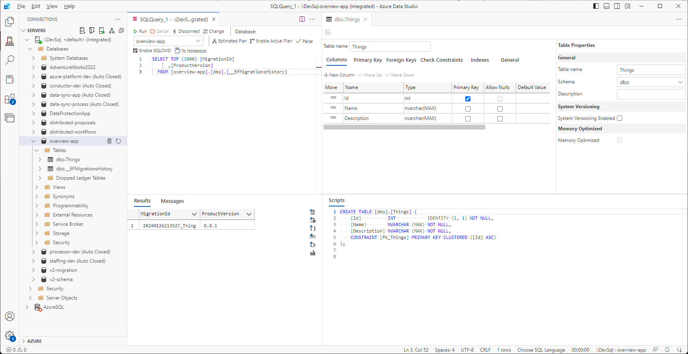

# Overview

The following workshop will focus on taking a very simple data model, and walking through each stage of the development platform. The intent is not for you to memorize all of the specific details that are shown or discussed, but to establish an initial acquaintance. This way a degree of familiarity exists when looking at a concept from a more complex perspective.

## Node Setup

The following steps will setup the backend server, referred to as a node, for the project. It is responsible for:
* defining data models
* establishing an interface with SQL through an object relational mapper (ORM) called Entity Framework Core.
* defining access and mutation logic for the data models in services
* exposing an HTTP-based interface through a REST API

Each of these functions are broken into their own .NET projects within a single .NET solution.

### Create the base directory structure

``` pwsh
mkdir overview
cd overview
mkdir node
```

### Initialize the dotnet infrastructure

```pwsh
cd node
dotnet new sln -n Overview
dotnet new classlib -o Overview.Models
dotnet new console -o Overview.Data
dotnet new classlib -o Overview.Services
dotnet new webapi -o Overview.Api
```

### Create solution references

This aggregates all of the projects into a single solution that simplifies management.

```pwsh
dotnet sln add Overview.Models
dotnet sln add Overview.Data
dotnet sln add Overview.Services
dotnet sln add Overview.Api
```

Open [`Overview.sln`](./overview/node/Overview.sln) to see the effect of these commands.

### Create project references

It's important to note that references only work in one direction. You cannot reference a project that references that same project, or try to create the reference indirectly through another project reference. This is called a circular dependency. Layer your dependencies from the bottom up.

```pwsh
cd Overview.Data
dotnet add reference ..\Overview.Models

cd ..\Overview.Services
dotnet add reference ..\Overview.Models
dotnet add reference ..\Overview.Data

cd ..\Overview.Api
dotnet add reference ..\Overview.Models
dotnet add reference ..\Overview.Data
dotnet add reference ..\Overview.Services
```

### Add project dependencies

Third-party libraries, or external dependencies, are managed by a package manager called NuGet.

```pwsh
cd ..\Overview.Data
dotnet add package Microsoft.EntityFrameworkCore.SqlServer
dotnet add package Microsoft.EntityFrameworkCore.Tools

cd ..\Overview.Services
dotnet add package Microsoft.EntityFrameworkCore.SqlServer

cd ..\Overview.Api
dotnet add package Microsoft.EntityFrameworkCore.Design
dotnet add package Microsoft.EntityFrameworkCore.SqlServer
```

Inspect the project files to see the project and package references:
* [`Overview.Models`](./overview/node/Overview.Models/Overview.Models.csproj)
* [`Overview.Data`](./overview/node/Overview.Data/Overview.Data.csproj)
* [`Overview.Services`](./overview/node/Overview.Services/Overview.Services.csproj)
* [`Overview.Api`](./overview/node/Overview.Api/Overview.Api.csproj)

## App Setup

The steps that follow rely on the [Angular Material Schematic](https://github.com/JaimeStill/ng-material-schematic). You will need to clone it locally and initialize it:

```pwsh
cd <path-to-schematic-root>
npm i -g @angular-devkit/schematics-cli @angular/cli
npm i
npm run build
```

Generate an Angular app from the schematic:

```pwsh
schematics .:app app --skip-git --skip-install --debug=false
```

After the app is initialized, move it into the *overview* directory:

```pwsh
mv app <path-to-overview-directory>
```

### Build and Run

Build and verify that the application runs as follows:

```pwsh
# change to app directory
cd overview/app

# install npm dependencies
npm i

# start the app
npm run start
```


## Build Node

The following sections will provide a very simplified, high-level walkthrough of building each component of a SQL-backed REST API.

### Models

The foundation of any capability is its data. You cannot effectively build an application without having a firm grasp on the information you want to store, how that information should be structured, and how the information should be allowed to interact with other information. The `Models` project is all about defining data models.

In the [`Overview.Models`](./overview/node/Overview.Models/) directory, rename `Class1.cs` to `Thing.cs`.

We are going to create a very simple .NET class named `Thing`. As with all things, it should have a `Name`. It should also have an identifier, `Id`, as well as a way to convey a deeper understanding of the object, a `Description`. With this in mind, `Thing` should look as follows:

```cs
namespace Overview.Models;

public class Thing
{
    public int Id { get; set; }
    public string Name { get; set; } = string.Empty;
    public string Description { get; set; } = string.Empty;
}
```

This class definition essentially specifies that an [object of type](https://learn.microsoft.com/en-us/dotnet/csharp/fundamentals/types/classes) `Thing` has three [properties](https://learn.microsoft.com/en-us/dotnet/csharp/properties). This basic setup allows us to define data models and the kinds of information they can contain. In this case, a numerical, whole number identifier (an [`integer`](https://learn.microsoft.com/en-us/dotnet/csharp/language-reference/builtin-types/integral-numeric-types) named `Id`) and two [string](https://learn.microsoft.com/en-us/dotnet/csharp/language-reference/builtin-types/reference-types#the-string-type) properties.

### Data

Now that we have a model, we need a way of storing data associated with that model. This process can be drastically simplified by relying on an [Object Relational Mapper (ORM)](https://en.wikipedia.org/wiki/Object%E2%80%93relational_mapping). .NET provides an official ORM called [Entity Framework Core](https://learn.microsoft.com/en-us/ef/core/).

#### EF CLI

To start, ensure that the [`dotnet-ef`](https://learn.microsoft.com/en-us/ef/core/cli/dotnet) CLI tool has been installed:

```pwsh
# check installation
dotnet ef

# install if not present
dotnet tool install --global dotnet-ef
```

You should see the following output:

```
                     _/\__       
               ---==/    \\      
         ___  ___   |.    \|\    
        | __|| __|  |  )   \\\   
        | _| | _|   \_/ |  //|\\ 
        |___||_|       /   \\\/\\

Entity Framework Core .NET Command-line Tools 8.0.0

Usage: dotnet ef [options] [command]

Options:
  --version        Show version information
  -h|--help        Show help information
  -v|--verbose     Show verbose output.
  --no-color       Don't colorize output.
  --prefix-output  Prefix output with level.

Commands:
  database    Commands to manage the database.
  dbcontext   Commands to manage DbContext types.
  migrations  Commands to manage migrations.

Use "dotnet ef [command] --help" for more information about a command.
```

#### DbContext

Next, we need to define a [`DbContext`](https://learn.microsoft.com/en-us/ef/core/dbcontext-configuration/#the-dbcontext-lifetime) class. This class is responsible for interfacing with the underlying SQL Server database. It translates all of our requests to retrieve or mutate data into T-SQL commands.

At the root of the [`Overview.Data`](./overview/node/Overview.Data/) project, create a new file named `AppDbContext.cs` with the following structure:

```cs
using Microsoft.EntityFrameworkCore;

namespace Overview.Data;
public class AppDbContext : DbContext
{
    public AppDbContext(DbContextOptions<AppDbContext> options) : base(options)
    { }
}
```

The [`using`](https://learn.microsoft.com/en-us/dotnet/csharp/language-reference/statements/using) statement at the top indicates that we want to bring all of the code infrastructure defined by the `Microsoft.EntityFrameworkCore` library into our file. This means that these code artifacts are defined in a [`namespace`](https://learn.microsoft.com/en-us/dotnet/csharp/language-reference/keywords/namespace) of `Microsoft.EntityFrameworkCore`. It is declared in the same way as our classes using the `namespace` keyword (in this case, `Overview.Data`).

The statement `AppDbContext : DbContext` means that `AppDbContext` [inherits](https://learn.microsoft.com/en-us/dotnet/csharp/fundamentals/object-oriented/inheritance) from the [DbContext](https://learn.microsoft.com/en-us/dotnet/api/microsoft.entityframeworkcore.dbcontext?view=efcore-8.0) class defined by `Microsoft.EntityFrameworkCore`.

The statement that starts with `public AppDbContext` inside of the class is the [constructor](https://learn.microsoft.com/en-us/dotnet/csharp/programming-guide/classes-and-structs/constructors). This specifies how an object can be created. Our data model `Thing` does not have a constructor, so an instance of it can be created without any arguments as follows:

```cs
Thing thing = new Thing();

# simplified - the compiler can infer the type
Thing thing = new();
```

In `AppDbContext`, it expects to receive an object of type `DbContextOptions<AppDbContext>`. Classes that specify another class type within angle brackets, `<T>`, are called [generic classes](https://learn.microsoft.com/en-us/dotnet/csharp/fundamentals/types/generics). This means that they're underlying functionality can flexibly work with different types of data.

If the base class, or the class that is being inherited, specifies a constructor with parameters, those values can be passed to the base constructor the `base` keyword as demonstrated in the constructor above: `: base(options)`.

Classes can have zero or more constructors as long as the signatures of the constructors do not match. If a class only has one constructor, it can leverage a new C# feature called [primary constructors]() to simplify the class definition. Our `AppDbContext` class can be simplified as follows:

```cs
using Microsoft.EntityFrameworkCore;

namespace Overview.Data;
public class AppDbContext(DbContextOptions<AppDbContext> options) : DbContext(options)
{ }
```

The only thing left to do with `AppDbContext` is specify the `Thing` table interface. This is done by defining a [`DbSet<T>`](https://learn.microsoft.com/en-us/ef/core/modeling/entity-types?tabs=data-annotations#including-types-in-the-model):

```cs
using Microsoft.EntityFrameworkCore;
using Overview.Models;

namespace Overview.Data;
public class AppDbContext(DbContextOptions<AppDbContext> options) : DbContext(options)
{
    public DbSet<Thing> Things => Set<Thing>();
}
```

Notice that to use the `Thing` class, the `Overview.Models` namespace had to be brought into scope with the `using` keyword at the top of the file. This is possible because we defined a reference to `Overview.Models` inside of `Overview.Data` in the [Create project references](#create-project-references) section above.

#### Configure SQL Project Connection

Before we can connect the project to SQL server, we need to incorporate some changes that make the project self-sufficient. This is why it was initialized with `dotnet new console` instead of just `dotnet new classlib`. We can leverage the [.NET Generic Host](https://learn.microsoft.com/en-us/dotnet/core/extensions/generic-host?tabs=appbuilder) to manage initialization and lifetime of `AppDbContext`.

First, we need to add a framework reference to `Microsoft.AspNetCore.App` in the [`Overview.Data.csproj`](./overview/node/Overview.Data/Overview.Data.csproj) file. Unfortunately, the dotnet cli does not have a way of specifying this from the command line, so it has to be added manually. Your full `.csproj` file should look like this:

```xml
<Project Sdk="Microsoft.NET.Sdk">

  <ItemGroup>
    <FrameworkReference Include="Microsoft.AspNetCore.App" />
  </ItemGroup>

  <ItemGroup>
    <ProjectReference Include="..\Overview.Models\Overview.Models.csproj" />
  </ItemGroup>

  <ItemGroup>
    <PackageReference Include="Microsoft.EntityFrameworkCore.SqlServer" Version="8.0.1" />
    <PackageReference Include="Microsoft.EntityFrameworkCore.Tools" Version="8.0.1">
      <IncludeAssets>runtime; build; native; contentfiles; analyzers; buildtransitive</IncludeAssets>
      <PrivateAssets>all</PrivateAssets>
    </PackageReference>
  </ItemGroup>

  <PropertyGroup>
    <OutputType>Exe</OutputType>
    <TargetFramework>net8.0</TargetFramework>
    <ImplicitUsings>enable</ImplicitUsings>
    <Nullable>enable</Nullable>
  </PropertyGroup>

</Project>
```

Next, we need to create appsettings files that contain our environment-specific [configuration](https://learn.microsoft.com/en-us/aspnet/core/fundamentals/configuration/?view=aspnetcore-8.0).

At the root of `Overview.Data`, create a file named `appsettings.json` with the following values:

```json
{
    "Logging": {
        "LogLevel": {
            "Default": "Information",
            "Microsoft.AspNetCore": "Warning"
        }
    },
    "AllowedHosts": "*"
}
```

This specifies default configuration settings that any environment-specific configurations inherit. Note that if an environment-specific setting specifies the same value, it overrides the value inherited from the root configuration.

To specify our development configuration, create a file named `appsettings.Development.json` with the following values:

```json
{
    "ConnectionStrings": {
        "App": "Server=.\\DevSql;Trusted_Connection=True;TrustServerCertificate=True;Database=overview-app"
    }
}
```

This defines a connection string named `App` pointed to a database named `overview-app` in our local `DevSql` server.

All that's left to do before we connect to SQL is define the app runtime in [`Program.cs`](./overview/node/Overview.Data/Program.cs):

```cs
using Microsoft.EntityFrameworkCore;
using Microsoft.Extensions.Configuration;
using Microsoft.Extensions.DependencyInjection;
using Microsoft.Extensions.Hosting;
using Overview.Data;

HostApplicationBuilder builder = Host.CreateApplicationBuilder(args);
builder.Configuration.AddCommandLine(args);

builder
    .Services
    .AddDbContext<AppDbContext>(options =>
    {
        options.UseQueryTrackingBehavior(QueryTrackingBehavior.NoTracking);
        options.UseSqlServer(builder.Configuration.GetConnectionString("App"));
    });

using IHost host = builder.Build();
await host.RunAsync();
```

The primary thing to notice here is the registration of `AppDbContext` with the `Services` container in the app builder. This is an example using native .NET [Dependency Injection](https://learn.microsoft.com/en-us/aspnet/core/fundamentals/dependency-injection?view=aspnetcore-8.0) to register a service.

The registration is conducted using the [`AddDbContext`](https://learn.microsoft.com/en-us/ef/core/dbcontext-configuration/#dbcontext-in-dependency-injection-for-aspnet-core) method (the .NET term for a function is a method), which is also responsible for configuring the options associated with the service. This is done using a delegate function to define design-time configuration:

```cs
.AddDbContext<AppDbContext>(options =>
{
    // configure options
});
```

The argument type for `.AddDbContext` is `Action<DbContextOptionsBuilder>`. [`Action<T>`](https://learn.microsoft.com/en-us/dotnet/api/system.action-1?view=net-8.0) is a [delegate function](https://learn.microsoft.com/en-US/dotnet/csharp/programming-guide/delegates/) that provides an argument of type `T` to the function and does not have a return value. The options specified in this configuration are what is used to compose the `DbContextOptions` passed into the constructor of `AppDbContext`.

> Delegate functions and generics are advanced .NET concepts. They are introduced in this section because you will work with them a lot and need to start building a conceptual idea of what they are. Luckily, they are pretty easy and powerful to work with, but learning how to craft your own use cases comes with a lot of time and experience.

#### Generating the Database

In order to generate a database, there are two things you need to do:

1. Create a [database migration](https://learn.microsoft.com/en-us/ef/core/managing-schemas/migrations/?tabs=dotnet-core-cli), which takes the state of the data models registered with `AppDbContext` and generates instructions for how to transition your database to the current state. It also includes instructions for how to roll your database back to its previous state in the event the migration does not work out. As your data models and configurations evolve over time, you can create new migrations to evolve the underlying database.

2. Initiate an [update](https://learn.microsoft.com/en-us/ef/core/managing-schemas/migrations/?tabs=dotnet-core-cli#create-your-database-and-schema) to the underlying database. If the database does not exist, it will create it and apply all generated migrations in sequence they were created. If a database does exist, it will apply every migration that has not been applied in sequence.

From the root of the `Overview.Data` project, execute the following command:

```pwsh
dotnet ef migrations add "Thing"
```

You should see the following output:

```
Build started...
Build succeeded.
```

This command generates a [Migrations](./overview/node/Overview.Data/Migrations) directory that keeps track of each migration as well as the current model snapshot.

To create the database and schema, execute the following command:

```pwsh
dotnet ef database update
```

You should see the following output:

```
Build started...
Build succeeded.
info: Microsoft.EntityFrameworkCore.Database.Command[20101]
      Executed DbCommand (185ms) [Parameters=[], CommandType='Text', CommandTimeout='60']
      CREATE DATABASE [overview-app];
info: Microsoft.EntityFrameworkCore.Database.Command[20101]
      Executed DbCommand (64ms) [Parameters=[], CommandType='Text', CommandTimeout='60']
      IF SERVERPROPERTY('EngineEdition') <> 5
      BEGIN
          ALTER DATABASE [overview-app] SET READ_COMMITTED_SNAPSHOT ON;
      END;
info: Microsoft.EntityFrameworkCore.Database.Command[20101]
      Executed DbCommand (5ms) [Parameters=[], CommandType='Text', CommandTimeout='30']
      SELECT 1
info: Microsoft.EntityFrameworkCore.Database.Command[20101]
      Executed DbCommand (9ms) [Parameters=[], CommandType='Text', CommandTimeout='30']
      CREATE TABLE [__EFMigrationsHistory] (
          [MigrationId] nvarchar(150) NOT NULL,
          [ProductVersion] nvarchar(32) NOT NULL,
          CONSTRAINT [PK___EFMigrationsHistory] PRIMARY KEY ([MigrationId])
      );
info: Microsoft.EntityFrameworkCore.Database.Command[20101]
      Executed DbCommand (0ms) [Parameters=[], CommandType='Text', CommandTimeout='30']
      SELECT 1
info: Microsoft.EntityFrameworkCore.Database.Command[20101]
      Executed DbCommand (9ms) [Parameters=[], CommandType='Text', CommandTimeout='30']
      SELECT OBJECT_ID(N'[__EFMigrationsHistory]');
info: Microsoft.EntityFrameworkCore.Database.Command[20101]
      Executed DbCommand (11ms) [Parameters=[], CommandType='Text', CommandTimeout='30']
      SELECT [MigrationId], [ProductVersion]
      FROM [__EFMigrationsHistory]
      ORDER BY [MigrationId];
info: Microsoft.EntityFrameworkCore.Migrations[20402]
      Applying migration '20240126213927_Thing'.
Applying migration '20240126213927_Thing'.
info: Microsoft.EntityFrameworkCore.Database.Command[20101]
      Executed DbCommand (2ms) [Parameters=[], CommandType='Text', CommandTimeout='30']
      CREATE TABLE [Things] (
          [Id] int NOT NULL IDENTITY,
          [Name] nvarchar(max) NOT NULL,
          [Description] nvarchar(max) NOT NULL,
          CONSTRAINT [PK_Things] PRIMARY KEY ([Id])
      );
info: Microsoft.EntityFrameworkCore.Database.Command[20101]
      Executed DbCommand (6ms) [Parameters=[], CommandType='Text', CommandTimeout='30']
      INSERT INTO [__EFMigrationsHistory] ([MigrationId], [ProductVersion])
      VALUES (N'20240126213927_Thing', N'8.0.1');
Done.
```

You can verify that the database has been created by connecting to `DevSql` in Azure Data Studio:



Here, you can see the `overview-app` contains a `Things` table as well as an `__EFMigrationsHistory` table. The `__EFMigrationsHistory` table is used to keep track of the migrations that have been applied to the database so you can keep your data models in sync with your project.

### Services

Services can be used to provide a host of functionality to your API. They don't need to purely focus on defining SQL-backed data model logic, but this is an excellent use case for demonstrating how to define and register services.

A service is nothing more than a class that defines functionality associated with a specific data model or capability. It could be anything from executing a PowerShell script to generate a GIF to leveraging the [OpenXML SDK](https://github.com/dotnet/Open-XML-SDK) to generate an Excel spreadsheet.

In our current case, we want to define a service that can:

* Get all Things
* Get a Thing by Id
* Validate that `Thing.Name` is unique
* Validate the overall state of a `Thing` so that `Thing.Name` always has a value and it is distinct from all other `Thing` records.
* Save a `Thing`
* Remove a `Thing`

To get started, rename `Class1.cs` to `ThingService.cs`. Now, because `AppDbContext` will be registered with dependency injection, we can inject an instance into `ThingService`. The first thing we will do is define `ThingService` with a primary constructor that injects `AppDbContext`:

```cs
using Overview.Data;

namespace Overview.Services;

public class ThingService(AppDbContext db)
{
    readonly AppDbContext db = db;
}
```

Next, we need to define the methods that enable our desired functionality. To start, we need to be able to get all `Thing` records:

```cs
public async Task<List<Thing>> GetThings() =>
    await db.Things.ToListAsync();
```

The `Microsoft.EntityFrameworkCore` library defines an [extension method](https://learn.microsoft.com/en-us/dotnet/csharp/programming-guide/classes-and-structs/extension-methods) for `DbSet<T>` called `ToListAsync()` that allows us to [asynchronously](https://learn.microsoft.com/en-us/dotnet/csharp/asynchronous-programming/) retrieve the data from the data set.

> Before I had a solid understanding of how to leverage inheritance to simplify my code structure, I used to define my services purely as static classes full of extension methods. It was incredibly unwieldy and inflexible. You should only ever write extension methods as utilities for classes that you don't own. And even then, this should be done very sparingly.

The next method is to retrieve a single `Thing` by its unique `Id`:

```cs
public async Task<Thing?> GetThing(int id) =>
    await db.Things.FindAsync(id);
```

Notice that the return type for `GetThing` is `Task<Thing?>`. The `?` indicates that the return value could be `null`, meaning it has no value. If you think about it, this certainly makes sense. Imagine the `Thing` table only has 10 records with IDs of 1 - 10 and someone calls `GetThing(30)`. There is no record that exists with an ID of 30, but we do not want that to throw an unnecessary exception. Instead, it should just return `null` and allow the caller to handle that value appropriately (for instance, returning a `404 Not Found` response from an HTTP call).

Again, `FindAsync()` is a method defined by `Microsoft.EntityFrameworkCore`.

> For a comprehensive understanding of querying data with Entity Framework Core, see [Querying Data](https://learn.microsoft.com/en-us/ef/core/querying/).

Now that you have a base understanding of how this works, the full service class is as follows:

```cs
using Microsoft.EntityFrameworkCore;
using Overview.Data;
using Overview.Models;

namespace Overview.Services;

public class ThingService(AppDbContext db)
{
    readonly AppDbContext db = db;

    public async Task<List<Thing>> GetThings() =>
        await db.Things.ToListAsync();

    public async Task<Thing?> GetThing(int id) =>
        await db.Things.FindAsync(id);

    public async Task<bool> ValidateName(Thing thing) =>
        await db.Things.AnyAsync(x =>
            x.Id != thing.Id
            && x.Name.ToLower() == thing.Name.ToLower()
        );

    public async Task<bool> Validate(Thing thing)
    {
        bool valid = true;

        if (string.IsNullOrWhiteSpace(thing.Name))
            valid = false;

        if (!await ValidateName(thing))
            valid = false;

        return valid;
    }

    public async Task<Thing?> Save(Thing thing)
    {
        if (await Validate(thing))
        {
            int result = thing.Id > 0
                ? await Update(thing)
                : await Add(thing);

            return result > 0
                ? thing
                : null;
        }
        else
            throw new Exception($"Save: Thing {thing.Id} - {thing.Name} is invalid");
    }

    public async Task<int> Remove(int id)
    {
        Thing? thing = await GetThing(id);

        if (thing is null)
            return 0;

        db.Things.Remove(thing);
        return await db.SaveChangesAsync();
    }

    async Task<int> Add(Thing thing)
    {
        await db.Things.AddAsync(thing);
        return await db.SaveChangesAsync();
    }

    async Task<int> Update(Thing thing)
    {
        db.Things.Update(thing);
        return await db.SaveChangesAsync();
    }
}
```

Some key points to note:

* Only the method marked with `public` can be called by a user of `ThingService`. The `Add` and `Update` functions are private and therefore internal to the class. This simplifies our API by allowing us to expose a single `Save` vs. having separate `Add` and `Update` methods.

    * See [Accessibility Levels](https://learn.microsoft.com/en-us/dotnet/csharp/language-reference/keywords/accessibility-levels).

* `ValidateName` makes use of the [boolean logical operators](https://learn.microsoft.com/en-us/dotnet/csharp/language-reference/operators/boolean-logical-operators) `!=` (does not equal) and `==` (is equal to) inside of Entity Frameworks `AnyAsync` function.

* `Save` makes use of the [ternary conditional operator](https://learn.microsoft.com/en-us/dotnet/csharp/language-reference/operators/conditional-operator) `?:` to simplify calling `Add` or `Update` as well as the return value. This is a shorthand syntax that is equivalent to:

    ```cs
    // if-else
    if (condition)
    {
        // execute if true
    }
    else
    {
        // execute if false
    }
    ```
    and is evaluated as:
    
    ```cs
    return condition
        ? execute if true
        : execute if false;
    ```

* `Remove` uses the newer [is](https://learn.microsoft.com/en-US/dotnet/csharp/language-reference/operators/is) operator to check if `thing` is `null`: `if (thing is null)`. This is equivalent to `if (thing != null)`.

    * Be aware that you cannot use the `is` operator inside of Entity Framework expressions. For instance, the following is invalid:
    
        ```cs
        db.Things.AnyAsync(x => x.Description is not null);
        ```

        You will get a design-time error stating *"An expression tree may not contain an 'is' pattern matching operator"*.

### API

## Build App

The following sections will provide a very simplified, high-level walkthrough of building an Angular app that interfaces with a SQL-backed REST API.

### Model

### Form

### Dialog

### Service

### Route

### Components