# App Development

The following sections will provide a very simplified, high-level walkthrough of building an Angular app that interfaces with a SQL-backed REST API.

## App Project Overview

Before digging into making adjustments, it's important to look at the structure of the app project to understand how it is setup.

> There is no need to memorize all of this. This is just to familiarize you with the project layout and give you an understanding of where things are defined and what they are for.

* **overview/app** - app project root
    * **src** - app project source files.
        * **app** - contains the Angular project source code.
            * **core** - a space for defining core services, utility classes, models, or any other useful features that are fundamental to the application.
                * **services** - contains fundamental app services.
                    * `snacker.service.ts` - a service that allows you to render Snackbar messages.
                    * `theme.service.ts` - a service that controls the light and dark mode theming.
            * **flex** - infrastructure that enables dynamically styling elements with [CSS Flexbox](https://css-tricks.com/snippets/css/a-guide-to-flexbox/) using [Angular directives](https://angular.dev/guide/directives/directive-composition-api).
            * **routes** - defines Angular route components.
            * `app.component.html` - the root Angular app component template file.
            * `app.component.scss` - the root Angular app component style file.
            * `app.component.ts` - the root Angular app component logic file.
            * `app.config.ts` - defines Angular [application configuration](https://angular.dev/reference/configs/file-structure#application-source-files) that tells Angular how to assemble the application.
            * `app.routes.ts` - defines the application's routing configuration.
        * **assets** - contains static assets to be copied as-is when building the project, and can be accessed by URL from the root of the app URL. For instance, *https://<app-url>/assets/images/logo.svg* would load the file located at *assets/images/logo.svg*.
        * **environments** - provides environment-specific configuration data inside of a TypeScript object. [*angular.json*](./overview/app/angular.json#L57) configuration provides the option to overwrite *environment.ts* with a different value based on the environment being built.
            * `environment.ts` - default configuration
            * `environment.prod.ts` - configuration to use when using the **production** configuration.
        * **theme** - provides global SCSS theming setup.
            * `color.scss` - defines color-specific styling based on the values in *palette.scss*.
            * `glow.scss` - defines colorful drop-shadow styling with elevation-based hovering animations. Also based on color values in *palette.scss*.
            * `layout.scss` - defines base app layout styles.
            * `material.scss` - defines style rules that override or extend [Angular Material](https://material.angular.io/components/categories) components.
            * `palette.scss` - defines a map of color key values to use based on the light or dark theme.
            * `snacker.scss` - defines color styling rules for the [Material Snackbar](https://material.angular.io/components/snack-bar/overview) component used with the core [SnackerService](./overview/app/src/app/core/services/snacker.service.ts).
            * `theme.scss` - the base [Angular Material theme](https://material.angular.io/guide/theming) style file.
            * `utility.scss` - defines structural styles for various CSS properties such as *margin*, *padding*, *border-radius*, *cursor*, *overflow*, etc. For instance, `class="m4"` would set the style rule `margin: 4px;` on the element.
        * `favicon.ico` - A small icon associated with a web app displayed within browser tabs, bookmark bars, and title headings. See [What is a favicon?](https://favicon.io/tutorials/what-is-a-favicon/)
        * `index.html` - The main HTML page that is served when visiting the Angular app. The CLI automatically adds all JavaScript and CSS files when building your app.
        * `main.ts` - The main entry point for the Angular application. The `AppComponent` is bootstrapped here so it can be loaded in *index.html*. 
    * `.editorconfig` - used with the [Editorconfig](https://editorconfig.org/) VS Code extension, provides formatting convention rules for the underlying code editor.
    * `.gitignore` - tells the [Git](https://git-scm.com/) source control software which files in the project to ignore for change tracking and source control.
    * `angular.json` - provides workspace-wide and project-specific configuration defaults. These are used for build and development tools provided by the Angular CLI. See [Angular workspace configuration](https://angular.dev/reference/configs/workspace-config).
    * `package.json` - Node.js project configuration file. Among many things, specifies project metadata, `npm run` script definitions, and dependencies. See [package.json](https://docs.npmjs.com/cli/v6/configuring-npm/package-json).
    * `tsconfig.app.json` - specifies app-specific TypeScript configuration settings expanded from the root `tsconfig.json`.
    * `tsconfig.json` - TypeScript project configuration file. Also specifies Angular TypeScript compiler options. See [What is a tsconfig.json](https://www.typescriptlang.org/docs/handbook/tsconfig-json.html) as well as [Angular compiler options](https://angular.dev/reference/configs/angular-compiler-options).

## App Cleanup

Before we get into building the app infrastructure, the `ApplicationConfig` located at *overview/app/src/app/app.config.ts* needs to be adjusted to provide the `HttpClient` service, as well as asynchronously load the animations services:

```ts
import { ApplicationConfig } from '@angular/core';
import { provideRouter } from '@angular/router';
import { provideHttpClient } from '@angular/common/http';
import { provideAnimationsAsync } from '@angular/platform-browser/animations/async';
import { routes } from './app.routes';

export const appConfig: ApplicationConfig = {
  providers: [
    provideRouter(routes),
    provideHttpClient(),
    provideAnimationsAsync()
  ]
};
```

Additionally, we need to clean up the [`HomeRoute`](./overview/app/src/app/routes/home.route.ts) component to remove all of the template sample code and give us a fresh starting point:

1. Open [*home.route.scss*](./overview/app/src/app/routes/home.route.scss) and delete all of the contents.

2. Open [*home.route.html*](./overview/app/src/app/routes/home.route.html) and set it to the following:

    ```html
    <h1 class="m8 mat-title">Home</h1>
    ```

3. Open [*home.route.ts*](./overview/app/src/app/routes/home.route.ts) and set it to the following:

    ```ts
    import { Component } from '@angular/core';

    @Component({
        selector: 'home-route',
        standalone: true,
        templateUrl: 'home.route.html',
        styleUrl: 'home.route.scss'
    })
    export class HomeRoute {}
    ```

## Model

In order to interface with the data models exposed by the REST API, we need to define a [TypeScript](https://www.typescriptlang.org/docs/handbook/) model that specifies the structure of the returned JSON data.

1. Inside of the *overview/app/src/app* directory, create a new directory named *models*.

2. Create a new file named *thing.ts* and give it the following value:

    ```ts
    export interface Thing {
        id: number;
        name: string;
        description: string;
    }
    ```

    An `interface` is preferred over a `class` because we only care about the shape of the data. For more details, see [TypeScript: Classes vs Interfaces](https://jameshenry.blog/typescript-classes-vs-interfaces/). 

3. In the *overview/app/src/app/models* directory, create a file named *index.ts* and give it the following value:

    ```ts
    export * from './thing';
    ```

    The pattern of specifying an *index.ts* at the root of a directory allows us to treat that directory as a [TypeScript module](https://jameshenry.blog/typescript-classes-vs-interfaces/), simplifying the way we reference infrastructure across the application.

## Service

Next, we need to create an [Angular Service](https://angular.dev/guide/di/creating-injectable-service) that allows us to interface with the REST API. This is done with the `@Injectable` [decorator](https://www.typescriptlang.org/docs/handbook/decorators.html) above the class definition.

For each public endpoint on [`ThingController`](./overview/node/Overview.Api/Controllers/ThingController.cs), we will define a function within the service that handles calling the corresponding endpoint.

1. In the *overview/app/src/app* directory, create a new folder named *services*.

2. In the new *services* directory, create a file named *thing.service.ts*:

    ```ts
    import { HttpClient } from '@angular/common/http';
    import { Injectable } from '@angular/core';
    import { firstValueFrom } from 'rxjs';
    import { environment } from '../../environments/environment';
    import { Thing } from '../models';

    @Injectable({
        providedIn: 'root'
    })
    export class ThingService {
        private api: string = `${environment.server}thing/`;

        constructor(
            private http: HttpClient
        ) { }

        getThings(): Promise<Thing[]> {
            return firstValueFrom(
                this.http.get<Thing[]>(
                    `${this.api}getThings`
                )
            );
        }

        getThing(id: number): Promise<Thing> {
            return firstValueFrom(
                this.http.get<Thing>(
                    `${this.api}getThing/${id}`
                )
            );
        }

        validateName = (thing: Thing): Promise<boolean> => {
            return firstValueFrom(
                this.http.post<boolean>(
                    `${this.api}validateName`,
                    thing
                )
            );
        }

        validate(thing: Thing): Promise<boolean> {
            return firstValueFrom(
                this.http.post<boolean>(
                    `${this.api}validate`,
                    thing
                )
            );
        }

        save(thing: Thing): Promise<Thing> {
            return firstValueFrom(
                this.http.post<Thing>(
                    `${this.api}save`,
                    thing
                )
            );
        }

        remove(id: number): Promise<number> {
            return firstValueFrom(
                this.http.delete<number>(
                    `${this.api}remove/${id}`
                )
            );
        }
    }
    ```

3. Create an *index.ts* file with the following content:

    ```ts
    export * from './thing.service';
    ```

In `ThingService`, an `api` variable is created that extracts the root server URL from the [*environment.ts*](./overview/app/src/environments/environment.ts) file. Additionally, the [HttpClient](https://angular.dev/guide/http/making-requests#best-practices) service is injected into the constructor.

Each function signature matches the signature of its corresponding endpoint on the API controller. It executes an HTTP request to the endpoint, passing in any parameters or body data as required, and converts the resulting [Observable](https://rxjs.dev/guide/observable) into a [Promise](https://developer.mozilla.org/en-US/docs/Web/JavaScript/Reference/Global_Objects/Promise) via the [`firstValueFrom`](https://rxjs.dev/api/index/function/firstValueFrom) function.

It's important to note that property validation functions need to be defined as *arrow functions*. This way, when they are registered for validation with the [`ApiValidator`](#asynchronous-validation) service, the bound value of `this` appropriately references the service instance that defines the validation function rather than the `ApiValidator` service instance. For more details, see [this](https://developer.mozilla.org/en-US/docs/Web/JavaScript/Reference/Operators/this).

## Route

Now that we have a data model and a service, we can setup our [`HomeRoute`](./overview/app/src/app/routes/home.route.ts) to retrieve and render our `Thing` data.

> Routes are nothing more than components that are registered as the root component for a URL endpoint. The following sections will have you performing some simple component configuration, but you will have a deeper dive into components in the [Components](#components) section.

### Route Logic

To start, we need to configure [*home.route.ts*](./overview/app/src/app/routes/home.route.ts) with the infrastructure it will need to retrieve and track `Thing` data:

```ts
import {
    Component,
    OnInit
} from '@angular/core';

import { ThingService } from '../services';
import { Thing } from '../models';

@Component({
    selector: 'home-route',
    standalone: true,
    templateUrl: 'home.route.html',
    styleUrl: 'home.route.scss',
    providers: [
        ThingService
    ]
})
export class HomeRoute implements OnInit {
    things: Thing[] = [];

    constructor(
        private thingSvc: ThingService
    ) { }

    async ngOnInit(): Promise<void> {
        this.things = await this.thingSvc.getThings();
    }
}
```

Lets unpack what is happening here. First, we imported the `OnInit` [Lifecycle Hook](https://angular.dev/guide/components/lifecycle), as well as `ThingService` and `Thing`. We added `ThingService` to the Component's [providers](https://angular.dev/guide/di/dependency-injection-providers) array, registering it with the component [dependency injection](https://angular.dev/guide/di/dependency-injection) container.

Then, we created a public `Thing[]` array named `things` and initialized it as an empty array, `[]`. An instance of `ThingService` is then injected in the constructor as the private property `thingSvc`. Finally, in the `ngOnInit` lifecycle hook, we initialize the value of `things` using the `ThingService.getThings()` function.

### Route Template

Now that the route logic has been defined, we need to define the structure of the route through its template, [*home.route.html*](./overview/app/src/app/routes/home.route.html):

```html
<h1 class="m8 mat-title">Home</h1>
@if (things.length > 0) {
    @for (thing of things; track thing.id) {
        <h3 class="m8 mat-h3 color-primary">{{thing.name}}</h3>
    }
} @else {
    <h3 class="m8 mat-h3 color-warn">No Things Available</h3>
}
```

Here, we use [Control Flow](https://angular.dev/guide/templates/control-flow) syntax to determine if we have any `Thing` data available. If so, iterate through all of them and render the name using [Text Interpolation](https://angular.dev/guide/templates/interpolation). Otherwise, render a message indicating *"No Things Available"*.

Run the API and the App simultaneously as follows:

1. Open the terminal in VS Code with <kbd>CTRL + `</kdb>.
2. Open a split terminal by ensuring focus is in the terminal panel and using the <kbd>CTRL + SHIFT + 5</kbd> shortcut.
    * The shortcut for opening a new terminal altogether is <kbd>CTRL + SHIFT + `</kbd>.
3. In the left terminal, execute the following:
    ```bash
    cd <path-to-overview>/node/Overview.Api
    dotnet run
    ```
4. In the right terminal, execute the following:
    ```bash
    cd <path-to-overview>/app
    npm run start
    ```

Open your browser and navigate to http://localhost:3000. You will see the home screen along with the message *No Things Available*.

If you've been following along from the beginning, you'll remember that we added a `Thing` when testing out the API Swagger interface. That means that we should be seeing the name of at least one `Thing` object.

If you press the <kbd>F12</kbd> key in the browser, you will see that the API is blocking requests from our app because it has not been configured to accept cross-origin requests (see [CORS](https://developer.mozilla.org/en-US/docs/Web/HTTP/CORS)). Let us fix that now.

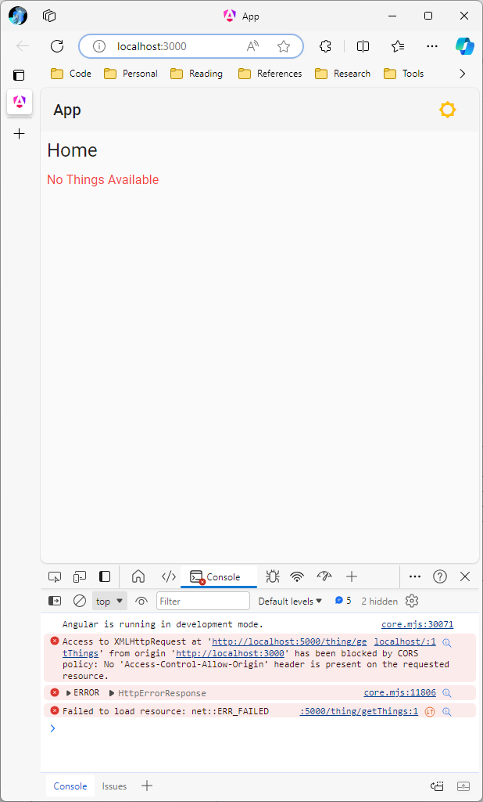

### Enable CORS on the API Server

In this scenario, we are going to configure the API to create a CORS setup that allows requests from any origin.

In the *overview/node/Overview.Api* directory, open *Program.cs* and adjust it as follows:

```cs
// just below builder.Services.AddDbContext<AppDbContext>(...)

builder
    .Services
    .AddCors(o => o.AddDefaultPolicy(builder =>
    {
        builder
            .AllowAnyOrigin()
            .AllowAnyMethod()
            .AllowAnyHeader();
    }));

// just above builder.Services.AddScoped<ThingService>();

// just below app.UseSwaggerUI();
app.UseCors();
// just above app.UseRouting();
```

Stop the node in the left terminal window with <kbd>CTRL + C</kbd> and re-start it with `dotnet run`.

If you refresh the Angular app, you should see the name *Awesome Thing* rendered and all console errors cleared:

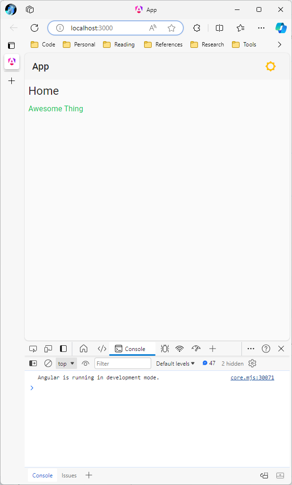

For details on configuring CORS in ASP.NET Core, see [Enable Cross-Origin Requests (CORS) in ASP.NET Core](https://learn.microsoft.com/en-us/aspnet/core/security/cors?view=aspnetcore-8.0).

For an example of a more restrictive CORS setup, see [`ConfigureDefaultCors`](https://github.com/JaimeStill/distributed-design/blob/main/nodes/core/Extensions/ServiceExtensions.cs#L51) along with an [`appsettings.CorsOrigin`](https://github.com/JaimeStill/distributed-design/blob/main/nodes/workflows/Workflows.Api/appsettings.Development.json#L21) configuration.

## Components

[Angular Components](https://angular.dev/guide/components) are the fundamental building block for creating applications in Angular. At a minimum, consist of:

* An `@Component` decorator that contains some configuration.
* A CSS selector that defines how the component is used in HTML.
* An HTML template that defines the structure of the component.
* A TypeScript class that defines the logic of the component, such as managing state, handling user input, etc.

Components can optionally define a CSS or SCSS file that defines encapsulated styling rules for the component. Any style rules defined apply only to the component.

Angular also provides the following features for components that make them extremely powerful:

* [**Input Properties**](https://angular.dev/guide/components/inputs) - Define the data that can be provided to the component through attributes.

* [**Output Properties**](https://angular.dev/guide/components/outputs) - Define functional events that allow you to react to changes or interactions with your component

* [**Lifecycle Hooks**](https://angular.dev/guide/components/lifecycle) - Allow you to execute logic at critical points in the lifecycle of the component.

### Thing List Component

Rather than hardcoding the infrastructure for retrieving and rendering the list of `Thing` data into a route, we should encapsulate it into its own component.

1. In the *overview/app/src/app* directory, create a folder named *components*.

2. Inside of the new *components* folder, create the following files:
    * *thing-list.component.ts*
    * *thing-list.component.html*
    * *index.ts*

To create the skeleton of a component, specify the following in *thing-list.component.ts*:

```ts
import { Component } from '@angular/core';

@Component({
    standalone: true,
    selector: 'thing-list',
    templateUrl: 'thing-list.component.html'
})
export class ThingListComponent {}
```

At this point, our component meets all of the minimum requirements. If we import the component into another component, we could use it with the `<thing-list>` element tag. However, since the *thing-list.component.html* template does not include any HTML code, it would not render anything.

However, before worrying about the component template, let's migrate the `Thing` logic out of `HomeRoute` and into `ThingListComponent`.

One additional change we should make is to make the `thing` array nullable and initialize it as `null`. This way, we can add an additional state to our template flow control to indicate that the HTTP request is loading. Even if there are no `Thing` records in the database, the HTTP request will still return an empty array.

**thing-list.component.ts**

```ts
import {
    Component,
    OnInit
} from '@angular/core';

import { ThingService } from '../services';
import { Thing } from '../models';

@Component({
    standalone: true,
    selector: 'thing-list',
    templateUrl: 'thing-list.component.html',
    providers: [ ThingService ]
})
export class ThingListComponent implements OnInit {
    things: Thing[] | null = null;

    constructor(
        private thingSvc: ThingService
    ) { }

    async ngOnInit(): Promise<void> {
        this.things = await this.thingSvc.getThings();
    }
}
```

The syntax `things: Thing[] | null` is a [TypeScript Union](https://www.typescriptlang.org/docs/handbook/2/everyday-types.html#union-types), or a way of indicating that a variable can be of any of the types specified.

**home.route.ts**

Note that since we aren't actually adding any component styling to `HomeRoute`, we can go ahead and delete *home.route.scss* and remove it from the `@Component` decorator.

```ts
import { Component } from '@angular/core';

@Component({
    selector: 'home-route',
    standalone: true,
    templateUrl: 'home.route.html'
})
export class HomeRoute { }
```

Now that the logic for the component is established, we can build out the template by simply cutting and pasting the `@if / @else` control flow statement infrastructure into the template file. We also need to adjust it to account for the fact that `things` can now be `null`:

**thing-list.component.html**

```html
@if (things === null) {
    <h3 class="m8 mat-h3">Loading...</h3>
}
@else if (things.length > 0) {
    @for (thing of things; track thing.id) {
        <h3 class="m8 mat-h3 color-primary">{{thing.name}}</h3>
    }
} @else {
    <h3 class="m8 mat-h3 color-warn">No Things Available</h3>
}
```

Before we can use `<thing-list>` in the `HomeRoute` template, we must first export it in `index.ts` and specify `ThingListComponent` in the `imports` array of the `@Component` decorator for `HomeRoute`:

**index.ts**

```ts
export * from './thing-list.component';
```

**home.route.ts**

```ts
import { Component } from '@angular/core';
import { ThingListComponent } from '../components';

@Component({
    selector: 'home-route',
    standalone: true,
    templateUrl: 'home.route.html',
    imports: [ ThingListComponent ]
})
export class HomeRoute { }
```

Now we can use `<thing-list>` in the `HomeRoute` template:

**home.route.html**

```html
<h1 class="m8 mat-title">Home</h1>
<thing-list></thing-list>
```

### Thing Card Component

Rendering a list of thing names is a helpful start, but it would be nice if we could provide a more robust interface for a `Thing` object instance. An interface that cleanly displays both the `name` and `description` properties, as well as actions for editing and removing the `Thing`.

To start, add the following files to the *components* folder:
* *thing-card.component.ts*
* *thing-card.component.html*

We will start by defining the basic component skeleton:

```ts
import { Component } from '@angular/core';

@Component({
    standalone: true,
    selector: 'thing-card',
    templateUrl: 'thing-card.component.html'
})
export class ThingCardComponent {}
```

Unlike the list component we defined before, this component does not interact with services to retrieve data. It is meant to simply receive data that it will render, and provide events to indicate when a user has performed a specific action.

Lets start by establishing the ability to provide data to the component:

```ts
import {
    Component,
    Input
} from '@angular/core';

import { Thing } from '../models';

@Component({
    standalone: true,
    selector: 'thing-card',
    templateUrl: 'thing-card.component.html'
})
export class ThingCardComponent {
    @Input({ required: true }) thing!: Thing;
}
```

The [Input decorator](https://angular.dev/guide/components/inputs) defines a property as an input property for a component, meaning the value of that property can be passed in via [property binding](https://angular.dev/guide/templates/property-binding) through a component attribute. This would look like:

```html
<thing-card [thing]="thing"></thing-card>
```

where the value of the provided `thing` object originates either from the underlying TypeScript file or elsewhere within the template (for instance, in a `@for` control flow statement).

Next, we need to define events that expose the ability for a user to edit or remove the `Thing` object:

```ts
import {
    Component,
    EventEmitter,
    Input,
    Output
} from '@angular/core';

import { Thing } from '../models';

@Component({
    standalone: true,
    selector: 'thing-card',
    templateUrl: 'thing-card.component.html'
})
export class ThingCardComponent {
    @Input({ required: true }) thing!: Thing;
    @Output() edit = new EventEmitter<Thing>();
    @Output() remove = new EventEmitter<Thing>();
}
```

The [Output decorator](https://angular.dev/guide/components/outputs) defines an event emitter as an output property. The `EventEmitter` exposes an `emit` function that you call when you want a component consumer to react to the corresponding event. If `EventEmitter` is defined without a type, it will simply trigger the event without providing any event data. If `EventEmitter` is defined with a type, in our case `EventEmitter<Thing>`, you must provide an object of that type to the `emit` function: `edit.emit(this.thing)`.

Registering to handle events is done as follows:

```html
<thing-card (edit)="editThing($event)"></thing-card>
```

Whenever `edit.emit(this.thing)` is executed in the `ThingCardComponent`, the `editThing` function will be executed in the parent component, receiving the provided `Thing` object through the `$event` keyword. See [Event Handling](https://angular.dev/essentials/handling-user-interaction#event-handling).

Finally, let us import the `FlexModule` and `MatButtonModule` to simplify structuring the template layout and allow us to use [Material Button](https://material.angular.io/components/button/overview) components:

**thing-card.component.ts**

```ts
import {
    Component,
    EventEmitter,
    Input,
    Output
} from '@angular/core';

import { MatButtonModule } from '@angular/material/button';
import { FlexModule } from '../flex';
import { Thing } from '../models';

@Component({
    standalone: true,
    selector: 'thing-card',
    templateUrl: 'thing-card.component.html',
    imports: [
        MatButtonModule,
        FlexModule
    ]
})
export class ThingCardComponent {
    @Input({ required: true }) thing!: Thing;
    @Output() edit = new EventEmitter<Thing>();
    @Output() remove = new EventEmitter<Thing>();
}
```

Next, we will create the template for the card. This is pretty straightforward:

**thing-card.component.html**

```html
<div class="border-divider rounded background-card"
     flexContainer
     flexDirection="column"
     flexMain="start"
     flexCross="stretch"
     [style.width.px]="360">
    <h1 class="m8 mat-h1">{{thing.name}}</h1>
    <p class="m8">{{thing.description}}</p>
    <div class="p8 background-default rounded-bottom"
         flexContainer
         flexMain="end"
         flexCross="center"
         flexGap="8px">
        <button mat-button
                color="warn"
                (click)="remove.emit(thing)">Remove</button>
        <button mat-button
                color="primary"
                (click)="edit.emit(thing)">Edit</button>
    </div>
</div>
```

Export `ThingCardComponent` in *index.ts*:

**index.ts**

```ts
export * from './thing-card.component';
```

### Use Thing Card Component

Now that the component is defined, we can use it inside of the `ThingListComponent`. First, let us import both `ThingCardComponent` and `FlexModule` in *thing-list.component.ts* to enable us to properly structure rendering a collection of `Thing` objects:

**thing-list.component.ts**

> Unnecessary code is left out for brevity

```ts
import { ThingCardComponent } from './thing-card.component';
import { FlexModule } from '../flex';

@Component({
    imports: [
        FlexModule,
        ThingCardComponent
    ]
})
```

We can now adjust the template to use the `<thing-card>` component instead of just rendering the name directly:

```html
@if (things === null) {
    <h3 class="m8 mat-h3">Loading...</h3>
}
@else if (things.length > 0) {
    <div class="p8" flexContainer flexMain="start" flexCross="start" flexGap="8px">
        @for (thing of things; track thing.id) {
            <thing-card [thing]="thing"></thing-card>
        }
    </div>
} @else {
    <h3 class="m8 mat-h3 color-warn">No Things Available</h3>
}
```

The next thing we need to do is handle the `edit` and `remove` events. For now, we will simply show a snacker message indicating the triggered action. We will properly wire these events to enable editing and removal in the [Finalizing the App](#finalizing-the-app) section at the end.

First, import and register `SnackerService` and add the following `edit` and `remove` functions:

**thing-list.component.ts**

> Unnecessary code is left out for brevity

```ts
import { SnackerService } from '../core';
@Component({
    providers: [
        SnackerService
    ]
})
export class ThingListComponent implements OnInit {
    constructor(
       private snacker: SnackerService,
       private thingSvc: ThingService
    ) { }

    edit(thing: Thing) {
        this.snacker.sendSuccessMessage(`Editing thing ${thing.name}`);
    }

    remove(thing: Thing) {
        this.snacker.sendWarningMessage(`Removing thing ${thing.name}`);
    }
}
```

Then in the `<thing-card>` element in the template, register the events:

```html
<thing-card [thing]="thing"
            (edit)="edit($event)"
            (remove)="remove($event)"></thing-card>
```

If you run the server and app now, you will can see the new `ThingCardComponent` rendered in the list component:

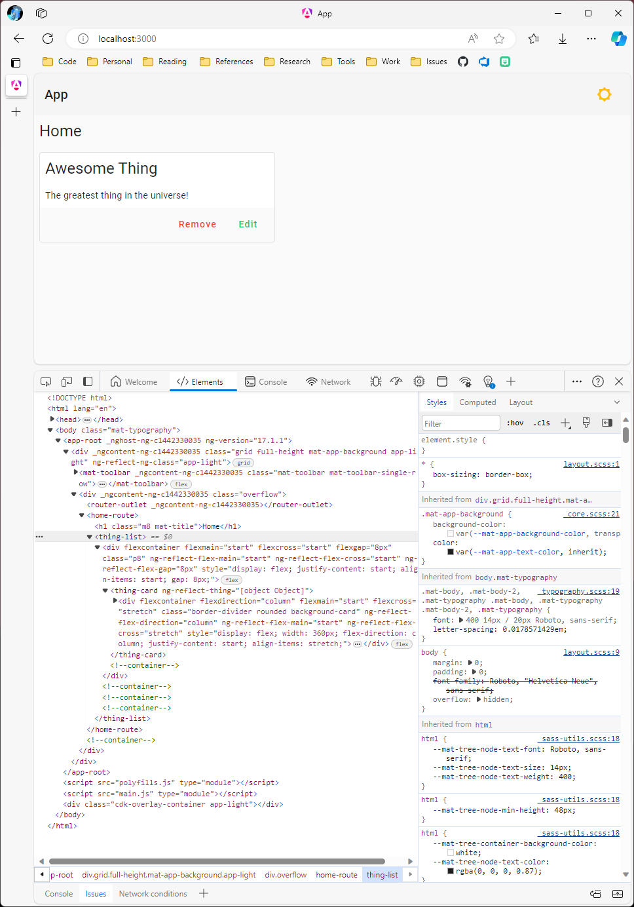

If you click on the **Edit** and **Remove** buttons with the console open, you will see the `Thing` object output to the console:

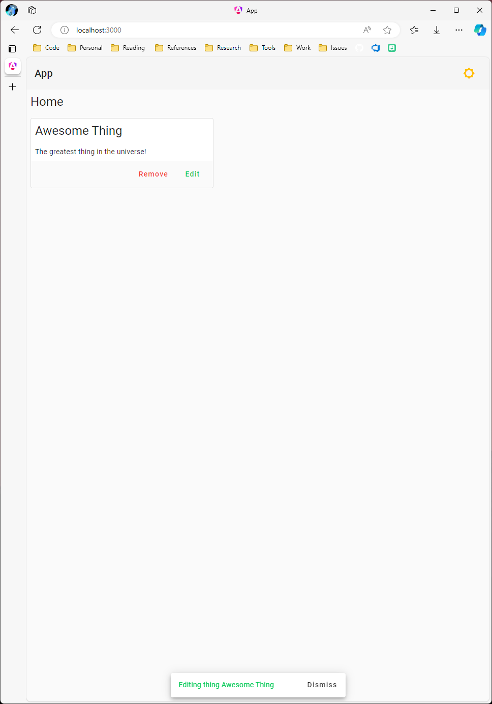

## Form

The first step towards providing a management interface for a data model is to define a [form](https://developer.mozilla.org/en-US/docs/Learn/Forms). Angular has a powerful feature called [Reactive forms](https://angular.dev/guide/forms/reactive-forms) that builds upon the native web forms infrastructure. It allows you to easily define form controls and implement features such as input validation. There are two steps to defining a form:

1. Defining a function that returns the structure of the form inside of a [`FormGroup`](https://angular.dev/guide/forms/reactive-forms#generate-a-new-component-with-a-formcontrol)

2. Define a component that maps the `FormGroup` to a `<form>` and its `FormControl` properties, which are tied to a data model property and bound to HTML form control elements (e.g. - `<input>`, `<select>`, etc.).

### `FormGroup` Function

Before we can build out form controls, we need to define a function that generates a `FormGroup`. This can be defined in the *thing.ts* file created in the [Model](#model) section above.

```ts
import {
    FormBuilder,
    FormGroup,
    Validators
} from '@angular/forms';

export interface Thing {
    id: number;
    name: string;
    description: string;
}

export function GenerateThingForm(thing: Thing, fb: FormBuilder): FormGroup {
    return fb.group({
        id: [thing.id],
        name: [
            thing.name || '',
            Validators.required
        ],
        description: [thing.description]
    });
}
```

The [`FormBuilder`](https://angular.dev/guide/forms/reactive-forms#inject-the-formbuilder-service) is an injectable provider that is provided with the reactive forms module.

`fb.group()` creates a new `FormGroup`, which is an object composed of `FormControl` objects. 

The `name` property is a little different from the other properties; it specifies two different features:
* If `thing.name` does not have a value, it defaults to the empty string, `''`. Additionally, a [`Validator`](https://angular.dev/guide/forms/form-validation#built-in-validator-functions) is associated with the form control indicating that `name` is a required form field. If no value is present on the form control, the overall form state will be marked invalid.

### Asynchronous Validation

The built-in support for [asynchronous validation](https://angular.dev/guide/forms/form-validation#creating-asynchronous-validators) is limiting in that it is tied to the form control element that the validation is being executed against. This means that your custom validator will only have access to the value of the property being validated, not the state of the overall object represented by the form.

If you'll recall, our [`ThingService.validateName`](./overview/app/src/app/services/thing.service.ts#L33) function requires you to post the full `Thing` object to the API to validate its name so it can also check the `id` of the object being compared.

To facilitate this, we can create an `ApiValidator` service that receives:
* An asynchronous validator function
* The `FormGroup` corresponding to the current object state
* The `AbstractControl` representing the validation property
* An optional string used to identify the error in the `control.errors` store.

This service will allow you to:
* listen for changes on the validated control
* execute the validator with the state of the overall object when the control value changes
* adjust the error state of the underlying control given the result of the asynchronous validation call

> Don't be too concerned with the full implementation details of the following service. The most important thing is that you understand what it is doing and how to use it in your forms.

In *overview/app/src/app/core/services*, create a file named *api-validator.service.ts* with the following contents:

```ts
import {
    AbstractControl,
    FormGroup
} from '@angular/forms';

import {
    debounceTime,
    distinctUntilChanged
} from 'rxjs/operators';

import { Injectable } from '@angular/core';
import { Subscription } from 'rxjs';

@Injectable({
    providedIn: 'root'
})
export class ApiValidator {
    private setErrorState = (control: AbstractControl, error: string, value?: boolean | null) => {
        if (value) {
            const errors = control.errors
                ? {
                    ...control.errors,
                    [error]: value
                }
                : {
                    [error]: value
                };

            control.setErrors(errors);
        } else if (control.errors) {
            if (control.errors.hasOwnProperty(error))
                delete control.errors[error];

            if (Object.keys(control.errors).length > 0)
                control.setErrors(control.errors);
            else
                control.setErrors(null);
        }
    }

    registerValidator = async<T>(
        validator: (obj: T) => Promise<boolean>,
        form: FormGroup,
        control: AbstractControl,
        error: string = 'api'
    ): Promise<Subscription> => {
        if (control.value) {
            const res = await validator(form.value);
            this.setErrorState(control, error, res ? null : true);
        }

        return control
            .valueChanges
            .pipe(
                debounceTime(350),
                distinctUntilChanged()
            )
            .subscribe(async (value: string) => {
                if (value) {
                    const res = await validator(form.value);
                    this.setErrorState(control, error, res ? null : true);
                } else
                    this.setErrorState(control, error);
            });
    }
}
```

Update the contents of *overview/app/src/app/core/services/index.ts* to export the `ApiValidator` service:

```ts
export * from './api-validator.service';
export * from './snacker.service';
export * from './theme.service';
```

### Form Component

Now that we can generate a `FormGroup` for our data model and asynchronously validate properties based on the state of the underlying object, we need to define the UI component that encapsulates a root `<form>` element and exposes form controls.

In the *overview/app/src/app* directory, create a directory named *forms*.

Create the following files in the *forms* directory:
* *index.ts*
* *thing.form.ts*
* *thing.form.html*

The `ThingForm` component will be responsible for several things:  
* Receiving an `Input` property `thing: Thing` that is modified through the underlying form.
* Defining an output event, `saved`, that lets the consumer know when the underlying `Thing` object has been successfully saved.
* Registering the `ApiValidator`, `FormBuilder`, and `ThingService` providers and receiving instances through constructor injection.
* Implementing the `OnChanges` lifecycle hook and detecting when the `thing` input property changes, including the first time it is initialized. When detected, initialize the `FormGroup` and register a validator for the `ThingService.validateName` call.
* Providing a `save` function that passes the current state of the form to `ThingService.save` and emits `saved` if the call is successful.

**thing.form.ts**  

```ts
import {
    Component,
    EventEmitter,
    Input,
    OnChanges,
    Output,
    SimpleChanges
} from '@angular/core';

import {
    FormBuilder,
    FormGroup,
    ReactiveFormsModule
} from '@angular/forms';

import {
    GenerateThingForm,
    Thing
} from '../models';

import { CommonModule } from '@angular/common';
import { TextFieldModule } from '@angular/cdk/text-field';
import { MatFormFieldModule } from '@angular/material/form-field';
import { MatInputModule } from '@angular/material/input';
import { ApiValidator } from '../core';
import { FlexModule } from '../flex';
import { ThingService } from '../services';

@Component({
    selector: 'thing-form',
    standalone: true,
    templateUrl: 'thing.form.html',
    imports: [
        CommonModule,
        FlexModule,
        MatFormFieldModule,
        MatInputModule,
        ReactiveFormsModule,
        TextFieldModule
    ],
    providers: [
        ApiValidator,
        FormBuilder,
        ThingService
    ]
})
export class ThingForm implements OnChanges {
    form!: FormGroup;
    get name() { return this.form.get('name') }

    @Input({ required: true }) thing!: Thing;
    @Output() saved = new EventEmitter<Thing>();

    constructor(
        private fb: FormBuilder,
        private thingSvc: ThingService,
        private validator: ApiValidator,
    ) { }

    ngOnChanges(changes: SimpleChanges): void {
        if (changes['thing']) {
            this.form = GenerateThingForm(this.thing, this.fb);

            this.validator.registerValidator(
                this.thingSvc.validateName,
                this.form,
                this.name!
            );
        }
    }

    async save(): Promise<void> {
        if (this.form.valid) {
            const res = await this.thingSvc.save(this.form.value);

            if (res)
                this.saved.emit(res);
        }
    }
}
```

In the *index.ts* file, export the `ThingForm` component:

```ts
export * from './thing.form';
```

Create the interface template for `ThingForm`.

**thing.form.html**

```html
@if (form) {
    <form [formGroup]="form">
        <div flexContainer
            flexDirection="column"
            flexMain="start"
            flexCross="stretch"
            flexGap="4px">
            <mat-form-field>
                <mat-label>Name</mat-label>
                <input matInput
                    formControlName="name">
                <mat-error *ngIf="name?.errors?.['required']">Name is required</mat-error>
                <mat-error *ngIf="name?.errors?.['api']">Name {{name?.value}} is already in use.</mat-error>
            </mat-form-field>
            <mat-form-field>
                <mat-label>Description</mat-label>
                <textarea matInput
                        formControlName="description"
                        cdkTextareaAutosize
                        [cdkAutosizeMinRows]="4"
                        [cdkAutosizeMaxRows]="8"></textarea>
            </mat-form-field>
        </div>
    </form>
}
```

In the first `<mat-form-field>` that corresponds to the `name` property, notice the two `<mat-error>` elements. These elements correspond to the two possible failed validation conditions:

* The `name` property does not have a value
* The asynchronous validation of `ThingService.validateName` returns false for the current value of `name`.

## Dialogs

Now that we have the `ThingForm` component, we need a clean way of presenting the form. This can be done by wrapping the form inside of a [Dialog](https://material.angular.io/components/dialog/overview). Dialogs are modular interface elements that render overlaid on top of the current UI.

To start, in the *overview/app/src/app* directory, create a folder named *dialogs* with the following contents:

* *index.ts*
* *thing.dialog.ts*
* *thing.dialog.html*

**thing.dialog.ts**

```ts
import {
    Component,
    Inject,
    OnInit
} from '@angular/core';

import {
    MatDialogModule,
    MatDialogRef,
    MAT_DIALOG_DATA
} from '@angular/material/dialog';

import { ThingForm } from '../forms';
import { Thing } from '../models';
import { MatButtonModule } from '@angular/material/button';

@Component({
    selector: 'thing-dialog',
    standalone: true,
    templateUrl: 'thing.dialog.html',
    imports: [
        MatButtonModule,
        MatDialogModule,
        ThingForm
    ]
})
export class ThingDialog implements OnInit {
    constructor(
        private dialog: MatDialogRef<ThingDialog>,
        @Inject(MAT_DIALOG_DATA) public thing: Thing
    ) { }

    ngOnInit(): void {
        if (!this.thing)
            this.dialog.close();
    }

    saved = (thing: Thing) => this.dialog.close(thing);
}
```

In *thing.dialog.ts*, all we need to do is:
* Register a `MatDialogRef` service that represents the current dialog, as well as an an injected `Thing`, retrieved through the `MAT_DIALOG_DATA` injection token.
    * The `MAT_DIALOG_DATA` token provides a way for the dialog to extract the value of the object specified by `MatDialogOptions.data` by the caller who opened the dialog.
* Implement the `OnInit` lifecycle hook to ensure that a `Thing` instance was passed to the dialog.
* Define a `saved` function that is called whenever the `ThingForm` component emits its `saved` event. The function closes the dialog, returning the saved `thing` instance to the consuming component.

Export the `ThingDialog` in *index.ts*:

```ts
export * from './thing.dialog';
```

**thing.dialog.html**

```html
<div class="mat-typography">
    <h2 mat-dialog-title>
        @if (thing.id > 0) {
            <span>Update Thing</span>
        } @else {
            <span>Add Thing</span>
        }
    </h2>
    <mat-dialog-content>
        <thing-form #editor
                    [thing]="thing"
                    (saved)="saved($event)"></thing-form>
    </mat-dialog-content>
    <mat-dialog-actions>
        <button mat-button
                color="primary"
                [disabled]="editor.form.invalid"
                (click)="editor.save()">
            Save Thing
        </button>
        <button mat-button
                color="warn"
                mat-dialog-close>
            Cancel
        </button>
    </mat-dialog-actions>
</div>
```

Because `ThingDialog` can be used to add or update a `Thing` object, the title is set based on the value of the `id` property.

Additionally, the `<thing-form>` element specifies a [Template Reference Variable](https://angular.dev/guide/templates/reference-variables), `#editor`, which allows other elements in the template to access the underlying `ThingForm` object. It also passes the `thing` instance provided to the dialog to the form and registers the `saved` event with its `saved` function.

The `editor` reference variable is used to set the `[disabled]` state of the **Save** button based on the validity of its internal form. When the **Save** button is clicked, the `ThingForm.save()` function is executed through the `editor` reference variable.

When the **Cancel** button is clicked, the dialog simply closes and nothing is returned to the calling component. The `mat-dialog-close` directive is what facilitates closing the dialog.

### Confirm Dialog

There is one additional dialog that needs to be created before we finish up the app. A `ConfirmDialog` that is used to prompt the user to confirm whether they truly want to execute a particular action. We will be using this dialog to prompt for confirmation when removing a `Thing`.

The dialog will receive an object with the following signature:

```js
{
    title: string,
    content: string
}
```

It will define two actions:

* Confirm, which closes the dialog and returns `true` to the calling component.
* Cancel, which closes the dialog and returns `false` to the calling component.

In the *overview/app/src/app/core* directory, create a *dialogs* folder with the following files:

* *index.ts*
* *confirm.dialog.ts*
* *confirm.dialog.html*

Update the *overview/app/src/app/core/index.ts* file to export all of the contents of the *dialog* folder:

```ts
export * from './dialogs';
export * from './services';
```

> Ignore the warning for now. It will clear whenever the `ConfirmDialog` is exported from *index.ts* inside of the *dialogs* directory.

**confirm.dialog.ts**

```ts
import {
    Component,
    OnInit,
    Inject
} from '@angular/core';

import {
    MAT_DIALOG_DATA,
    MatDialogModule
} from '@angular/material/dialog';

import { MatButtonModule } from '@angular/material/button';

@Component({
    selector: 'confirm-dialog',
    standalone: true,
    templateUrl: 'confirm.dialog.html',
    imports: [
        MatButtonModule,
        MatDialogModule
    ]
})
export class ConfirmDialog implements OnInit {
    constructor(
        @Inject(MAT_DIALOG_DATA) public data: { title: string, content: string }
    ) { }

    ngOnInit() {
        if (this.data) {
            this.data.title = this.data.title
                ? this.data.title
                : 'Confirm Action?';

            this.data.content = this.data.content
                ? this.data.content
                : 'Are you sure you would like to perform this action?';
        } else {
            this.data = {
                title: 'Confirm Action?',
                content: 'Are you sure you would like to perform this action?'
            };
        }
    }
}
```

Export `ConfirmDialog` in *index.ts*:

```ts
export * from './confirm.dialog';
```

**confirm.dialog.html**

```html
<div class="mat-typography">
    <h2 mat-dialog-title>{{data.title}}</h2>
    <mat-dialog-content>
        <p>{{data.content}}</p>
    </mat-dialog-content>
    <mat-dialog-actions>
        <button mat-button
                [mat-dialog-close]="false">Cancel</button>
        <button mat-button
                color="warn"
                [mat-dialog-close]="true">Confirm</button>
    </mat-dialog-actions>
</div>
```

## Finalizing the App

Now we have everything we need to wrap up the app.

* We can add and edit `Thing` instances using the `ThingDialog`, which encapsulates the `ThingForm` component.

* We can prompt for confirmation using `ConfirmDialog` before executing sensitive actions such as deleting `Thing` records.

The following sections will walk you through the final steps needed to enable this functionality.

### Adding a Thing

To make it easier to expose an **Add Thing** button in our app, let us adjust the `HomeRoute` component, defined in *overview/app/src/app/routes*, by removing the heading from the *home.route.html* template.

**home.route.html**

```html
<thing-list></thing-list>
```

We will prepare `ThingListComponent` by importing the `MatButtonModule` and adding a placeholder `add()` function:

**thing-list.component.ts**

> Unnecessary code is left out for brevity

```ts
import { MatButtonModule } from '@angular/material/button';

@Component({
    imports: [
        MatButtonModule
    ]
})
export class ThingListComponent implements OnInit {
    add() {
        this.snacker.sendSuccessMessage(`Adding thing...`);
    }
}
```

In the `ThingListComponent` template, we will create a flex row container that contains the heading and the **Add Thing** button with spacing between the two elements:

**thing-list.component.html**

```html
<!-- place at the top -->
<div flexContainer
     flexMain="space-between"
     flexCross="center"
     class="p4">
    <h1 class="m4 mat-title">Things</h1>
    <button mat-button
            color="primary"
            class="m4"
            (click)="add()">
        Add Thing
    </button>
</div>
<!-- remainder of template -->
```

In order to simplify refreshing our `things` array whenever the underlying `Thing` SQL table is modified, we will create a `refresh()` function to encapsulate the functionality defined in `ngOnInit`:

**thing-list.component.ts**

> Unnecessary code is left out for brevity

```ts
private async refresh() {
    this.things = await this.thingSvc.getThings();
}

async ngOnInit(): Promise<void> {
    await this.refresh();
}
```


Next, we need to import the `MatDialogModule` as well as our `ThingDialog` component and restructure the `add` function to facilitate adding a `Thing` object using our `ThingForm`.

**thing-list.component.ts**

> Unnecessary code is left out for brevity

```ts
import {
    MatDialog,
    MatDialogModule
} from '@angular/material/dialog';

import { ThingDialog } from '../dialogs';

@Component({
    imports: [
        MatDialogModule
    ]
})
export class ThingListComponent implements OnInit {
    constructor(
        private dialog: MatDialog
    ) { }

    add() {
        this.dialog.open(ThingDialog, {
            disableClose: true,
            data: <Thing>{
                id: 0,
                name: '',
                description: ''
            },
            width: '90%',
            maxWidth: '600px'
        })
        .afterClosed()
        .subscribe(async (result: Thing | null) => {
            if (result) {
                this.snacker.sendSuccessMessage(`Thing ${result.name} successfully added`);
                this.refresh();
            }
        });
    }
}
```

If we the app now and click **Add Thing**, we will see that our dialog properly renders our form:

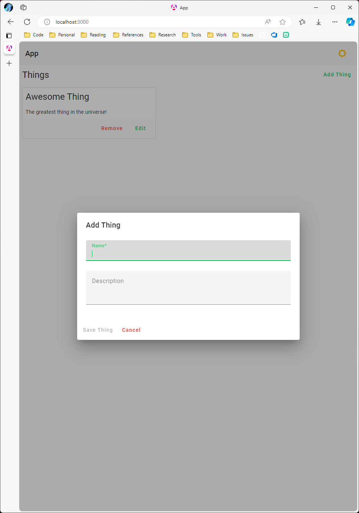

If we tab away from the **Name** input, we will see the validation error indicating the *Name is required*:

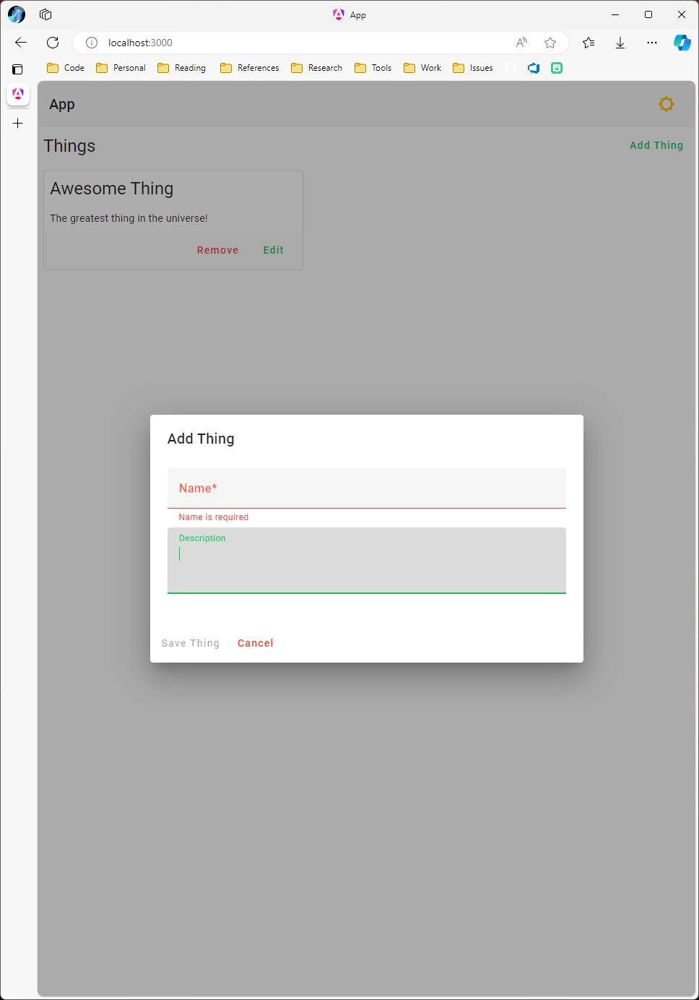

If we focus back on the **Name** input and set the value to *Awesome Thing*, we will see that our asynchronous validation is correctly working and providing us the error *Name Awesome Thing is already in use.*:

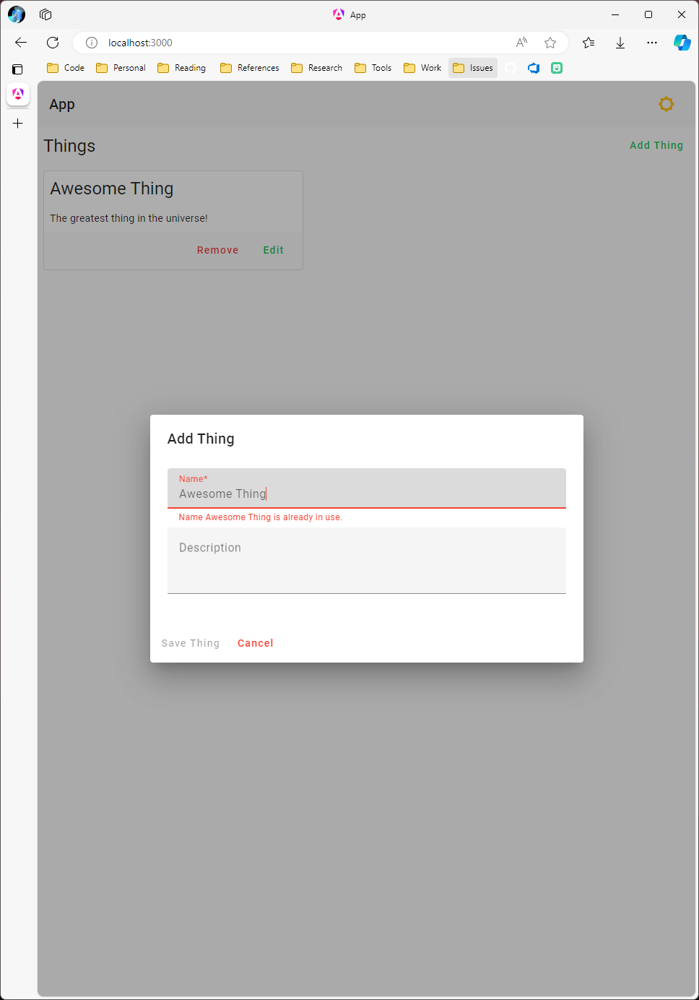

If we provide the form with valid values, the form validation will enable the **Save Thing** button:

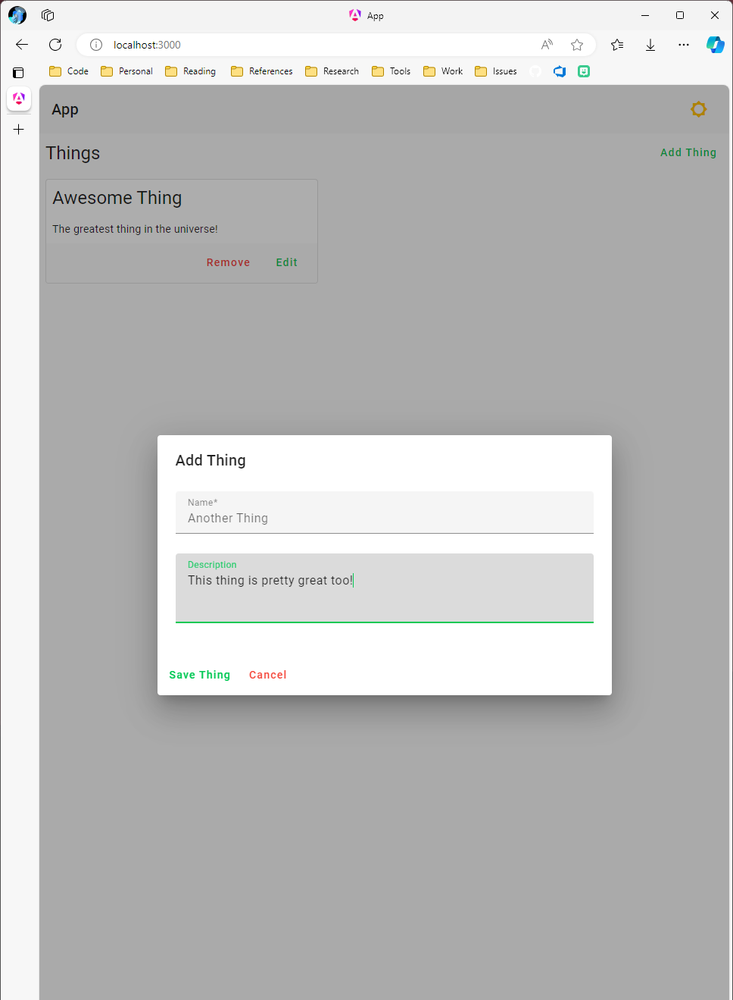

Clicking **Save Thing** will cause our `Thing` to be saved and the `ThingListComponent` will refresh with the new object:

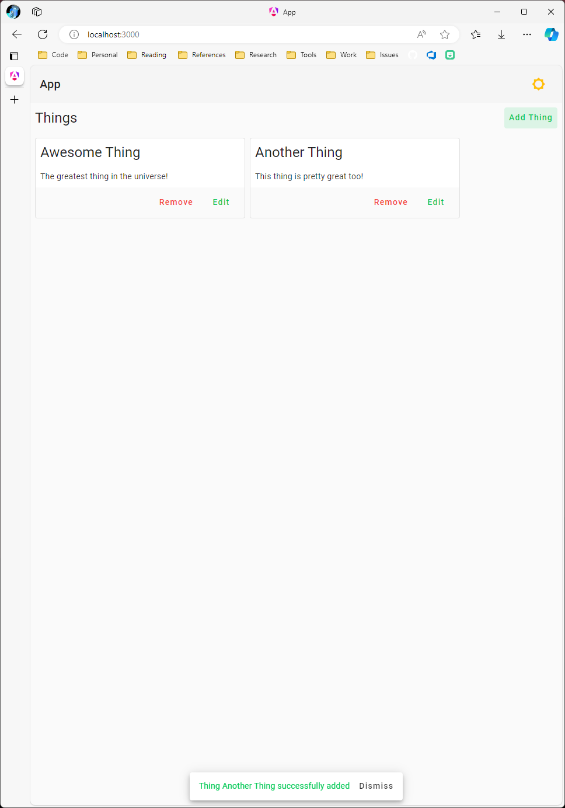

### Editing a Thing

To support editing, all we need to do is replace the body of the `edit` function to pass the provided `thing` instance to the `ThingDialog`. Most of the details of opening and reacting to the result of a `ThingDialog` are common between the `add` and `edit` functions, so we can encapsulate the functionality in a private function and just pass the proper `data` object to the private function:

**thing-list.component.ts**

> Unnecessary code is left out for brevity

```ts
private openThingDialog(thing: Thing) {
    this.dialog.open(ThingDialog, {
        disableClose: true,
        data: thing,
        width: '90%',
        maxWidth: '600px'
    })
    .afterClosed()
    .subscribe(async (result: Thing | null) => {
        if (result) {
            this.snacker.sendSuccessMessage(`Thing ${result.name} successfully saved`);
            this.refresh();
        }
    });
}

add() {
    this.openThingDialog(<Thing>{
        id: 0,
        name: '',
        description: ''
    });
}

edit(thing: Thing) {
    this.openThingDialog(thing);
}
```

If we click the **Edit** button on *Another Thing*, we can see that our dialog and form are functioning properly:

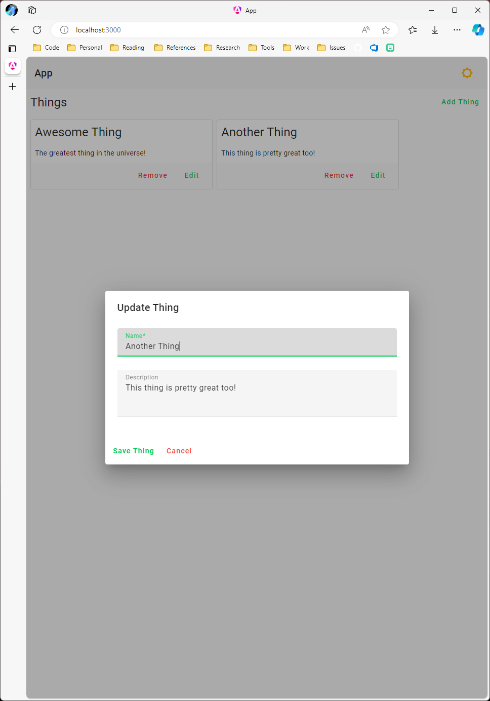

If we change the *Name* to *Modified Thing* and click **Save Thing**, the corresponding `Thing` database record is properly updated:

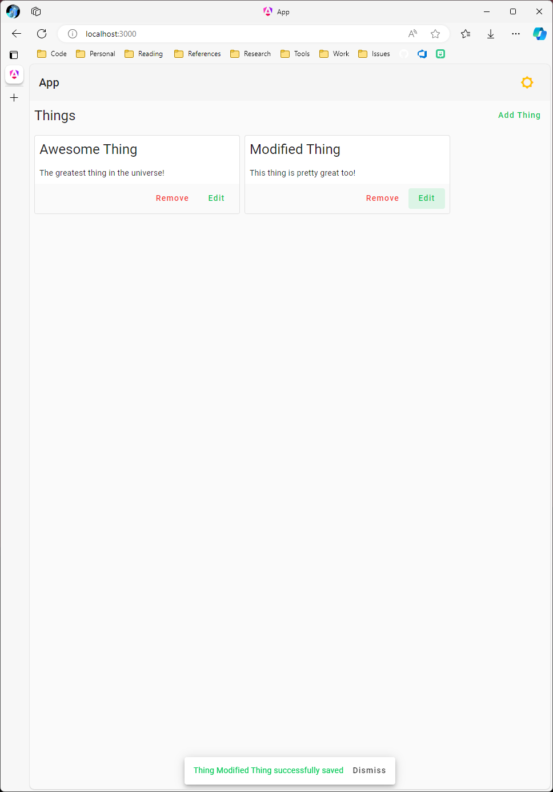

### Removing a Thing

The last thing we need to do is support removing `Thing` records. First, we need to import the `ConfirmDialog`:

**thing-list.component.ts**

> Unnecessary code is left out for brevity

```ts
import {
    ConfirmDialog,
    SnackerService
}
```

Then we can modify the `remove` function to prompt the user to confirm before removing the `Thing`:

**thing-list.component.ts**

> Unnecessary code is left out for brevity

```ts
remove(thing: Thing) {
    this.dialog.open(ConfirmDialog, {
        disableClose: true,
        autoFocus: false,
        data: {
            title: `Remove Thing`,
            content: `Are you sure you want to remove Thing "${thing.name}"?`
        }
    })
    .afterClosed()
    .subscribe(async (result: boolean) => {
        if (result) {
            const res = await this.thingSvc.remove(thing.id);

            if (res) {
                this.snacker.sendSuccessMessage(`Thing ${thing.name} successfully removed`);
                this.refresh();
            }
        }
    });
}
```

If we click **Remove** on our *Modified Thing*, we can see the `ConfirmDialog` prompt displayed:

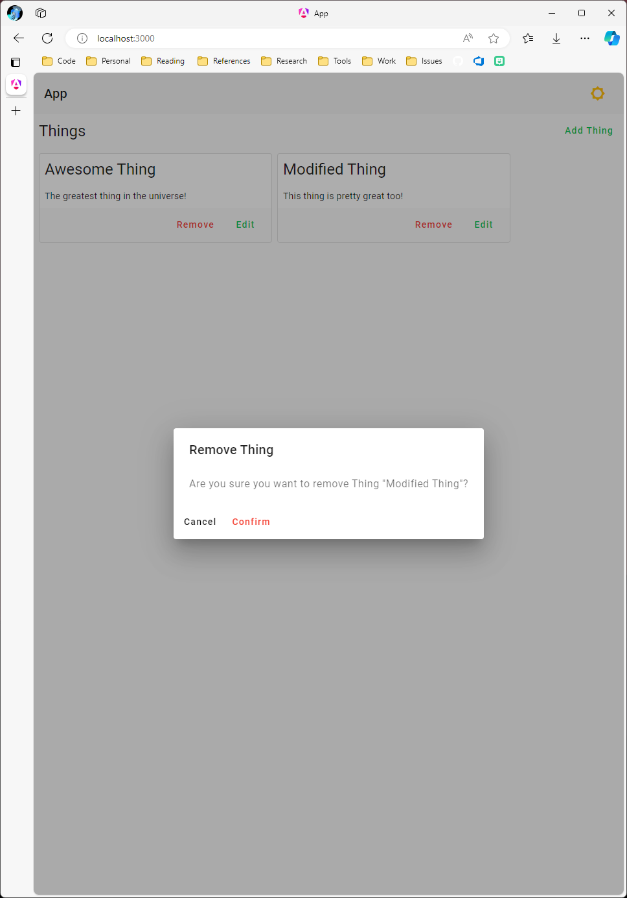

If we click the **Confirm** button, the `Thing` record is deleted from the underlying SQL database and the list is refreshed:

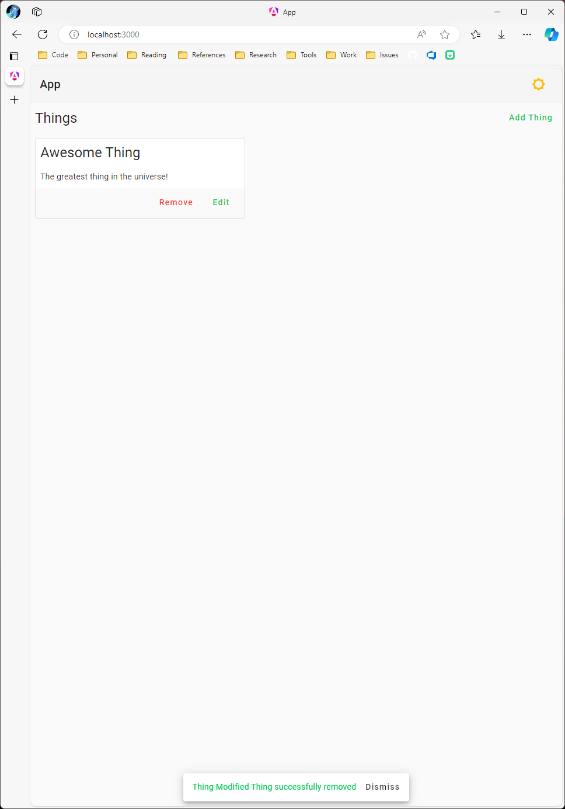
