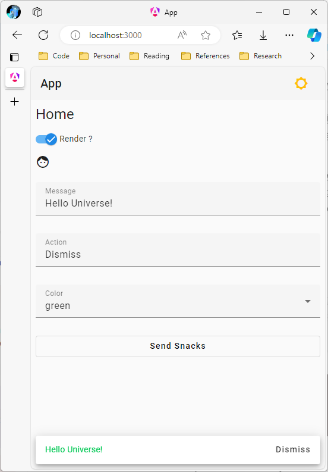

# Project Setup

This document will walk you through scaffolding all of the necessary infrastructure to build out a .NET Core Node and an Angular App.

## Node Setup

The following steps will setup the backend server, referred to as a node, for the project. It is responsible for:
* defining data models
* establishing an interface with SQL through an object relational mapper (ORM) called Entity Framework Core.
* defining access and mutation logic for the data models in services
* exposing an HTTP-based interface through a REST API

Each of these functions are broken into their own .NET projects within a single .NET solution.

### Create the base directory structure

``` pwsh
mkdir overview
cd overview
mkdir node
```

### Initialize the dotnet infrastructure

```pwsh
cd node
dotnet new sln -n Overview
dotnet new classlib -o Overview.Models
dotnet new console -o Overview.Data
dotnet new classlib -o Overview.Services
dotnet new webapi -o Overview.Api
```

### Create solution references

This aggregates all of the projects into a single solution that simplifies management.

```pwsh
dotnet sln add Overview.Models
dotnet sln add Overview.Data
dotnet sln add Overview.Services
dotnet sln add Overview.Api
```

Open [`Overview.sln`](./overview/node/Overview.sln) to see the effect of these commands.

### Create project references

It's important to note that references only work in one direction. You cannot reference a project that references that same project, or try to create the reference indirectly through another project reference. This is called a circular dependency. Layer your dependencies from the bottom up.

```pwsh
cd Overview.Data
dotnet add reference ..\Overview.Models

cd ..\Overview.Services
dotnet add reference ..\Overview.Models
dotnet add reference ..\Overview.Data

cd ..\Overview.Api
dotnet add reference ..\Overview.Models
dotnet add reference ..\Overview.Data
dotnet add reference ..\Overview.Services
```

### Add project dependencies

Third-party libraries, or external dependencies, are managed by a package manager called NuGet.

```pwsh
cd ..\Overview.Data
dotnet add package Microsoft.EntityFrameworkCore.SqlServer
dotnet add package Microsoft.EntityFrameworkCore.Tools

cd ..\Overview.Services
dotnet add package Microsoft.EntityFrameworkCore.SqlServer

cd ..\Overview.Api
dotnet add package Microsoft.EntityFrameworkCore.Design
dotnet add package Microsoft.EntityFrameworkCore.SqlServer
```

Inspect the project files to see the project and package references:
* [`Overview.Models`](./overview/node/Overview.Models/Overview.Models.csproj)
* [`Overview.Data`](./overview/node/Overview.Data/Overview.Data.csproj)
* [`Overview.Services`](./overview/node/Overview.Services/Overview.Services.csproj)
* [`Overview.Api`](./overview/node/Overview.Api/Overview.Api.csproj)

## App Setup

The steps that follow rely on the [Angular Material Schematic](https://github.com/JaimeStill/ng-material-schematic). You will need to clone it locally and initialize it:

```pwsh
cd <path-to-schematic-root>
npm i -g @angular-devkit/schematics-cli @angular/cli
npm i
npm run build
```

Generate an Angular app from the schematic:

```pwsh
schematics .:app app --skip-git --skip-install --debug=false
```

After the app is initialized, move it into the *overview* directory:

```pwsh
mv app <path-to-overview-directory>
```

### Build and Run

Build and verify that the application runs as follows:

```pwsh
# change to app directory
cd overview/app

# install npm dependencies
npm i

# start the app
npm run start
```

